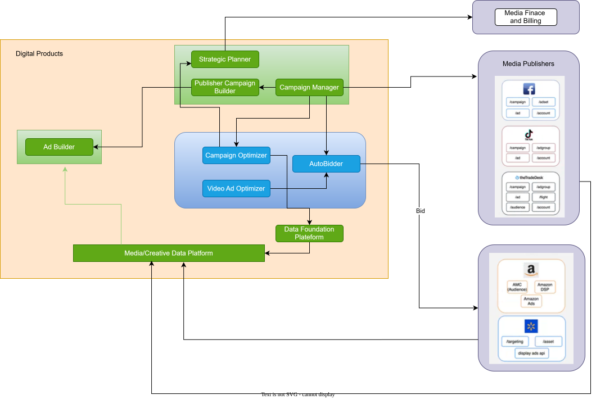

# Marketing ROI Analysis

[Published documentation](https://trance-0.github.io/MTA-strategy-optimizer/en/) · [Project overview](docs/en/introduction/index.md) · [Environment setup](docs/en/environment/index.md) · [Module inventory](docs/en/reference/module-inventory.md) · [Version log](docs/version/index.md) · [Work log](docs/worklog/index.md)

Marketing ROI Analysis is a validation-oriented Python workspace for historical Multi-Touch Attribution (MTA), standardized model evaluation, and explainable advertising budget initialization. It builds five-segment Amazon Marketing Cloud-style paths, compares Markov and path-level Shapley attribution, adapts four-segment MTA-SIM data to a shared model contract, and produces a deterministic Ad Group budget seed from governed attribution evidence.

The workspace contains three business modules, preserved local Agent/BMad artifacts, research sources, and historical implementation records. The preserved workflow tools are reference material only and are not the Trance-0 development process or part of the model runtime.

## Project status

**Current stage: runnable pre-production analytics and model-validation workspace.**

- The attribution pipeline, standardized model interface, deterministic budget initializer, validators, and test suites are implemented and runnable.
- Markov is the official displayed attribution method; Shapley provides model-sensitivity evidence.
- The Deep Neural Network (DNN) model in `mta_attribution` is a learned surrogate of path-level Shapley shares, not an independent causal estimator.
- The strategy module produces an explainable initial budget with `is_optimized=false`; it does not predict marginal returns or optimize future spend.
- Current inputs and canonical outputs are synthetic demonstration data.
- Production Amazon Marketing Cloud privacy execution, rolling-window stability analysis, causal incrementality validation, automated activation, and online experimentation have not been completed.

The current results are appropriate for reproducible development, contract testing, and offline model comparison. They must not be presented as production-grade causal attribution or an automated Return on Investment (ROI) optimizer.

## Start here

| Goal | Documentation |
| --- | --- |
| Review the workspace assessment and risks | [Workspace assessment](docs/en/introduction/assessment.md) |
| Understand the project objective and delivery boundary | [Project overview](docs/en/introduction/index.md) |
| Follow the directory and data flow | [Project structure](docs/en/introduction/project-structure.md) |
| Set up and run the project | [Environment setup](docs/en/environment/index.md) |
| Run Amazon Marketing Cloud MTA attribution | [AMC MTA usage](docs/en/environment/amc-mta-usage.md) |
| Understand the standardized model interface | [Standardized MTA interface](docs/en/attribution/standardized-interface/index.md) |
| Generate and validate an initial Ad Group budget | [Strategy initializer](docs/en/strategy/module-overview.md) |
| Reproduce the current budget step by step | [Current Ad Group budget calculation](docs/en/strategy/current-budget-calculation.md) |
| Plan the research path from MTA to budget optimization | [Budget optimization problem and research plan](docs/en/strategy/optimization-plan.md) |
| Review the current module boundaries | [Module inventory](docs/en/reference/module-inventory.md) |
| Review input, path, and metric contracts | [AMC data contract](docs/en/datasets/amc-data-contract.md) |
| Review dual-model governance | [Model governance](docs/en/attribution/model-governance.md) |
| Interpret touchpoint reliability | [Reliability guide](docs/en/attribution/reliability.md) |
| Review maturity and planned work | [Progress and todos](docs/en/introduction/progress.md) |
| Review implementation specifications | [Specification catalog](docs/en/specifications/index.md) |
| Review who did what and when | [Work log roster](docs/worklog/index.md) |
| Review all maintained commands | [Project command directory](script/README.md) |
| Inspect historical product decisions | [Design artifacts](design-artifacts/README.md) |
| Inspect specifications and implementation records | [BMad output index](_bmad-output/README.md) |

## Current capabilities

[](MTA-roi-analysis.drawio)

The SVG above is the English render of the editable [Draw.io architecture source](MTA-roi-analysis.drawio).

The maintained implementation currently provides:

- One synthetic source of truth and four derived data views: anonymous conceptual events, aggregate paths, an Amazon Ads-style daily report, and a touchpoint/entity aggregate.
- A five-segment interaction key: `AD_PRODUCT:FORMAT:PLACEMENT:CREATIVE:INTERACTION_TYPE`.
- Three independent outcomes: converted users, purchase count, and revenue.
- Two 18-column model results plus 14-column touchpoint comparison, 13-column overall summary, and 15-column recommendation outputs.
- A current sample containing 17 five-segment touchpoints and 51 touchpoint/outcome recommendation rows.
- Three explicit reliability checks in the dual-model artifacts; the current 90-day sample contains `51 RELIABLE / 0 UNRELIABLE` recommendation rows.
- Reliable recommendations use the official Markov share. Unreliable recommendations expose the ascending closed interval between Markov and Shapley rather than averaging them.
- A strategy sample representing one Campaign Group and four Campaigns through two JSON inputs, with candidate counts, capacity, budget, and Amazon Marketing Cloud lineage.
- A capacity-derived `1/1/1/1` new Ad Group count for the current sample. All 17 attribution touchpoints pass through the entity bridge to Campaign shares before equal allocation among anonymous new groups within each Campaign.
- A standardized MTA-SIM dataloader, explicit four-to-five segment adapter, common attribution interface, output contract, evaluator, and DNN credit model.

The budget result contains no targeting plan, activation instructions, or claim of optimality.

## Repository structure

```text
marketing-roi-analysis/
├── modules/
│   ├── mta_attribution/              # Model interface, concrete attribution models, paths, comparison, and outputs
│   ├── mta_standard/                 # MTA-SIM adapter, registry, execution, contracts, and evaluation
│   └── mta_strategy_recommendation/  # Campaign Group and Ad Group count/budget initializer
├── external/
│   └── mta_sim_dataset/              # Pinned MTA-SIM-dataset Git submodule and ZheyuanWu generator
├── script/                            # All maintained project command-line entry points
├── docs/
│   ├── en/                           # Active published English documentation
│   ├── zh/                           # Preserved Chinese sources; currently excluded from publication
│   ├── en/specifications/            # Project-level English specification catalog
│   ├── zh/specifications/            # Chinese specification source backups for future publication
│   ├── research/                     # External references; never runtime model input
│   └── .vitepress/                   # Documentation site configuration
├── design-artifacts/                 # Historical product briefs and decisions
├── _bmad-output/                     # Specifications and implementation records
├── .agents/ and _bmad/               # Development workflow tools; not runtime dependencies
├── pyproject.toml                    # Non-package uv project configuration
├── uv.lock                           # Reproducible Python environment lockfile
└── .python-version                   # Python 3.12 selection for uv
```

Only `modules/` contains the current business implementations. Historical artifacts, installed development tools, and research attachments do not participate in the runtime data flow.

## Prerequisites

- [uv](https://docs.astral.sh/uv/)
- Python 3.12 or newer
- Git with submodule support
- Node.js 20 or a newer Long-Term Support release, and npm, only for the documentation site

The Python implementation uses only the standard library. The `uv` configuration is intentionally non-package: it creates an environment for running and testing this repository but does not build, install, or publish it as a Python module.

## Initialize the data-generator submodule

After cloning the repository, initialize the pinned MTA-SIM dataset source:

```sh
git submodule update --init --recursive
```

The submodule is stored at `external/mta_sim_dataset` and points to [Trance-0/MTA-SIM-dataset](https://github.com/Trance-0/MTA-SIM-dataset). The maintained integration uses its `ZheyuanWu` generator directly from source; it does not install or publish either repository as a package.

## Create the uv environment

From the repository root:

```sh
uv sync --locked
```

This creates `.venv` with Python 3.12 and verifies the environment against `uv.lock`. The environment is ignored by Git. Python 3.12 is pinned because the strategy suite compares the canonical budget result exactly, including floating-point serialization.

Use `uv run` for project commands; manual activation is not required. To activate it explicitly:

```powershell
.\.venv\Scripts\Activate.ps1
```

```sh
source .venv/bin/activate
```

## Generate and adapt MTA-SIM data

The primary data-generation command runs the pinned ZheyuanWu baseline toy configuration and validates the generated tables through the local four-to-five-segment adapter:

```sh
uv run python -X utf8 -B script/generate_mta_sim_dataset.py
```

Generated files are written to the ignored `generated/mta_sim/` directory. The original four-segment ZheyuanWu tables remain unchanged. The adapter additionally creates a single-scope path report for local models and a separate evaluation-only ground-truth view.

Use another public or private configuration and caller-owned output directory with:

```sh
uv run python -X utf8 -B script/generate_mta_sim_dataset.py --config path/to/config.json --output path/to/generated-data
```

The older repository-specific generators remain under `script/` as compatibility commands for reproducing the committed five-segment demonstration dataset, but they are no longer the primary data source.

## Run the attribution pipeline

Run from the repository root:

```sh
uv run python -X utf8 -B script/run_pipeline.py
```

The default pipeline reads synthetic inputs under `modules/mta_attribution/data/simulated/`, rebuilds the aggregate path report, runs Markov and Shapley attribution, validates the complete result, and publishes five canonical attribution CSV files under `modules/mta_attribution/outputs/attribution/`.

Use caller-owned paths when testing other approved datasets:

```sh
uv run python -X utf8 -B script/run_pipeline.py --events-file path/to/amc_touchpoint_events.csv --amazon-ads-report path/to/amazon_ads_report.csv --path-report path/to/amc_path_report.csv --output-dir path/to/attribution_outputs
```

The pipeline detects its reporting window from the Amazon Ads input. Review the [AMC data contract](docs/en/datasets/amc-data-contract.md) before replacing inputs.

## Run the strategy initializer

Check that the deterministic strategy result still matches the committed canonical output:

```sh
uv run python -X utf8 -B script/generate_initial_budget.py --check-output
uv run python -X utf8 script/validate_simulated_hierarchy.py
```

Without `--check-output`, the generator writes a newly calculated result to standard output. It does not activate campaigns or change advertising budgets.

## Run all business-module tests

```sh
uv run python -X utf8 -B -m unittest discover -s modules/mta_attribution/tests -p "test_*.py"
uv run python -X utf8 -B -m unittest discover -s modules/mta_standard/tests -p "test_*.py"
uv run python -X utf8 -B -m unittest discover -s modules/mta_strategy_recommendation/tests -p "test_*.py"
```

The current suites contain 107 attribution tests, 138 standardized-interface tests, and 34 strategy tests.

## Run focused validation

```sh
uv run python -X utf8 script/validate_data_alignment.py
uv run python -X utf8 script/validate_simulated_hierarchy.py
uv run python -X utf8 -m compileall modules
```

Expected results for the committed synthetic data:

- The attribution pipeline detects the 90-day Amazon Ads window, rebuilds the anonymous aggregate paths, and publishes all five contract outputs.
- All 17 Amazon Marketing Cloud and Amazon Ads five-segment touchpoints align across reporting window, account, marketplace, and currency.
- All 279 business-module tests pass.
- All 51 recommendation rows have `RELIABLE` status.
- The strategy initializer reproduces and validates the committed budget seed.

## Run the documentation site

The Python `uv` environment and Node.js documentation environment are independent:

```sh
cd docs
npm ci
npm run dev
```

Build the English production site with:

```sh
npm run build
```

English is the active published language. Detailed Chinese sources under `docs/zh/` are preserved but excluded from the current site build.

## Runtime outputs

The attribution pipeline publishes:

```text
modules/mta_attribution/outputs/attribution/amc_markov_attribution_results.csv
modules/mta_attribution/outputs/attribution/amc_shapley_attribution_results.csv
modules/mta_attribution/outputs/attribution/amc_mta_model_comparison_touchpoints.csv
modules/mta_attribution/outputs/attribution/amc_mta_model_comparison_summary.csv
modules/mta_attribution/outputs/attribution/amc_mta_recommended_attribution.csv
```

The strategy module maintains the deterministic canonical result at:

```text
modules/mta_strategy_recommendation/outputs/initial_budget_recommendation.json
```

## Explicit boundaries

- Synthetic conceptual event samples demonstrate local path algorithms; they do not imply that Amazon Marketing Cloud exports user-level event details.
- Markov is the governed display method and Shapley is a sensitivity reference; their outputs are not averaged.
- Current results are attribution diagnostics, not causal advertising incrementality evidence.
- Simulation ground truth is evaluation-only and must never be used as a training feature.
- The workspace has no rolling-window stability analysis, resampling evidence, production privacy enforcement, automated budget optimization, or campaign activation.
- The strategy module supplies an explainable initial point only; long-term optimization belongs to a separate downstream process.
- Product briefs, requirements, forecasts, optimization proposals, experiments, and AI-assisted design records are historical vision unless current source and contracts implement them.
- External PDF, DOCX, JSON, and research notes under `docs/research/` are retained references and are not runtime model inputs.
- Do not commit credentials, customer-level data, production account identifiers, or real generated campaign data.

For detailed architecture, contracts, limitations, and the development roadmap, start with the [English documentation home](docs/en/index.md).
