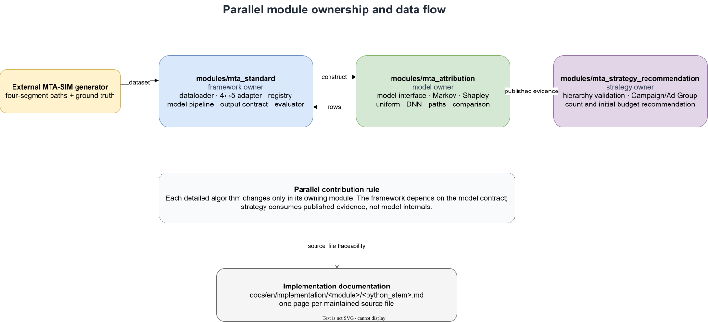

# AMC MTA Architecture

## Architecture Conclusion

The current project is a single-process, standard-library-first, CSV-driven AMC MTA batch module. Its value is not a platform shell; it is a reproducible and validated loop connecting anonymous aggregate paths, dual-model attribution, Amazon Ads cost, and governance diagnostics.



[Edit the Draw.io source](../../../assets/architecture/module-ownership.drawio)

In real use, user events must become anonymous aggregates inside the AMC clean room. This repository accepts only aggregates that satisfy privacy thresholds; its user-event source and conceptual events are test fixtures rather than exportable real AMC user detail.

## Component Responsibilities

| Component | Responsibility |
| --- | --- |
| `src/synthetic_event_pipeline.py` | synthetic fact source, AMC/Ads/entity derivation, privacy and conservation checks |
| `src/touchpoint_key.py` | construct and strictly validate five-segment keys; keep impressions and clicks separate |
| `src/path_report_builder.py` | event ordering, 14-day contiguous gaps, multiple-purchase segmentation, anonymous aggregation |
| `src/attribution_contract.py` | input validation, Markov, Shapley, Ads cost aggregation, efficiency measures, atomic CSV writes |
| `src/attribution_model_comparison.py` | five-segment support, model gaps, three reliability criteria, total variation distance, ranking, governed recommendations |
| `script/` | project-level path building, compatibility generation, attribution, comparison, and validation entry points |
| `script/run_pipeline.py` | derive the window from Ads dates, build complete temporary artifacts, and restore previous files if publication fails |
| `tests/` | lock field contracts, boundaries, conservation, strict parsing, and publication rollback |

The runtime modules are regular Python packages. Maintained command wrappers add only the project root when invoked directly; reusable model and framework modules use explicit package-relative imports.

The canonical entry point does not use simulated dates from configuration. Users may replace the default event and Ads files or pass custom inputs, path output, and attribution output directories. The program publishes the path report and five model/governance files without modifying the two source inputs. Ads rows must form a contiguous daily grid with the same touchpoint set every day. Input or model failure occurs before the six derived artifacts are published as a set.

## Data Contract

### Five-Segment Touchpoint

```text
AD_PRODUCT:FORMAT:PLACEMENT:CREATIVE:INTERACTION_TYPE
```

Advertising components contain uppercase letters, digits, and underscores. Missing placement or creative becomes `UNSPECIFIED` inside the normalized key. The fifth segment is `IMPRESSION` or `CLICK`. AMC paths, Amazon Ads rows, and outputs share the complete key, so exposure, click, and cost remain distinct.

### Simulated Data Layer

| Input | Recorded sample size | Role |
| --- | ---: | --- |
| synthetic user events | 11,147 rows | sole dynamic fact source for simulation |
| anonymous conceptual events | 645 rows | validate local path construction |
| AMC aggregate paths | 153 rows | direct attribution input |
| Amazon Ads daily report | 1,530 rows | 17 touchpoints over 90 days |
| touchpoint-entity aggregate | 34 rows | anonymous historical evidence linking touchpoints to Campaign/Ad Group entities |

One run accepts a single marketplace, advertiser, currency, and reporting window. AMC and Ads require the same touchpoint set and complete daily coverage. CPC cost belongs only to `CLICK`; CPM cost belongs only to `IMPRESSION`; non-billable interactions have zero cost.

### Path Construction

- Sort in Coordinated Universal Time (UTC); naive times are currently interpreted as UTC.
- Every adjacent touchpoint and the final touchpoint-to-purchase edge is at most 14 days; exactly 14 days qualifies.
- The first gap above 14 days removes the earlier prefix, while total path duration has no independent cap.
- The earliest retained touchpoint must be strictly later than the report start boundary.
- For multiple purchases in one journey, a later purchase cannot reuse touchpoints before the preceding purchase.
- Grouping currently uses `journey_id` alone, which is a scope-isolation risk to resolve before production.

## Model Semantics

### Markov

The project implements a first-order weighted Markov removal effect:

- the `converted_users` model includes both `CONVERSION` and `NULL`, weighted by converted and non-converted users;
- `purchase_count` and `revenue` models retain positive-Outcome paths and use orders or revenue as weights;
- removal redirects transitions entering the removed node to `NULL` and stops the path;
- negative removal effects are clipped to zero; if every effect is zero, credit is equal.

Converted-user output is closest to a conversion-probability removal effect. Purchase and revenue output are better described as weighted contribution allocations over positive-Outcome path structures, not independent order/revenue occurrence probabilities. Removal semantics, negative clipping, and the equal fallback still benefit from hand-calculated benchmarks and methodological review.

### Path-Level Shapley

Current Shapley is the exact closed form of a path unanimity game: each aggregate path's Outcome is divided equally among its unique touchpoints, then summed over paths. Repeated occurrences on one path receive one membership share.

It preserves path participation but not order or repetition frequency and is not a general response Shapley model fitted across all observed coalitions. Documentation and output should call it `Path-level Shapley`.

## Output Architecture

| File | Recorded rows | Purpose |
| --- | ---: | --- |
| `amc_markov_attribution_results.csv` | 17 | five-segment Markov result |
| `amc_shapley_attribution_results.csv` | 17 | five-segment Shapley result |
| `amc_mta_model_comparison_touchpoints.csv` | 51 | shares, gaps, support, reliability |
| `amc_mta_model_comparison_summary.csv` | 3 | one summary per Outcome |
| `amc_mta_recommended_attribution.csv` | 51 | official, benchmark, recommended value, reliability |

Both models conserve converted users, purchase count, and revenue independently. ROI, ROAS, CPA, and cost per converted user use the same five-segment spend; efficiency fields are empty for zero-cost rows. The recommendation is a governance view, not a third attribution model: Markov is the official display, Shapley is the benchmark, and `recommended_value` is the Markov point when reliable or the ordered model-share interval otherwise. It is not a budget-decision value and grants no automation authority.

The three comparison artifacts expose calculation validity, sufficient support, model consistency, and binary reliability. The recorded sample had `51 RELIABLE / 0 UNRELIABLE`. Outcome summaries AND-aggregate each touchpoint Boolean. Total variation distance, Spearman correlation, and Top-K overlap appear only in the summary and do not determine reliability.

## Reliability and Tests

The 107-test source baseline covered:

- five-segment keys and CPC/CPM billing conflicts;
- path ordering, the 14-day boundary, report start, and multiple-purchase non-reuse;
- invalid metric relationships, duplicate timestamps, and reserved states;
- conservation and rounding residuals for three Outcomes;
- model sets, cost, window, scope, and strict CSV header agreement;
- five-segment support, gap thresholds, total variation distance, Spearman, and Top K;
- three reliability thresholds, fixed reason order, long tails, and zero-Outcome boundaries;
- multi-file publication rollback and filename-based matching.

Tests establish conformance with the current contract; they do not independently prove causal truth. Exact reproducibility of synthetic events primarily provides regression evidence rather than external validity.

## Implementation Traceability

| Claim | Implementation | Principal test |
| --- | --- | --- |
| five-segment key and CPC/CPM assignment | `src/touchpoint_key.py`, `aggregate_spend_by_touchpoint()` | `test_touchpoint_key.py` |
| 14-day path, start boundary, purchase segmentation | `src/path_report_builder.py` | `test_amc_path_builder.py` |
| Markov/Shapley semantics and conservation | `src/attribution_contract.py` | `test_amc_mta_attribution.py` |
| gaps, support, reliability, governance | `src/attribution_model_comparison.py` | `test_model_comparison.py` |
| full reproduction and publication rollback | `script/run_pipeline.py`, `script/` | `test_end_to_end_pipeline.py` |

The migrated source recorded baseline commit `1000bcc` plus its reliability implementation and stated that code, tests, documents, and five outputs were synchronized to the three-criterion contract. Current code and tests supersede that dated statement if they differ.

## Productionization Boundary

Current gaps include:

- executable AMC query templates, privacy thresholds, and query-version management;
- real-window history, promotion/season slices, and data-snapshot versions;
- rolling windows, 3/7/14-day sensitivity, and suitable resampling stability;
- process locks or version-directory/manifest publication with stronger consistency;
- currency in the AMC path contract and `Decimal` monetary calculations;
- packaging, dependency locking, continuous integration, and production monitoring;
- causal-incrementality experiments or calibration.

These gaps do not prevent the demonstration from running, but they prevent it from being an automatic-budget or production-attribution service.
