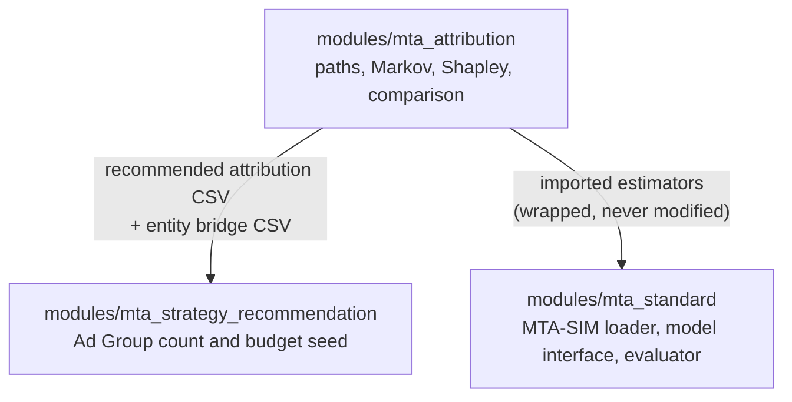

# Module and Script Data Flow

This page follows one report from raw events to a budget seed, naming the file responsible at every step. Read it when you need to know *where* a value comes from, or *why* a boundary exists where it does.

## The Three Modules <span class="status-label status-verified" aria-label="Verified"></span>



Dependencies run one way. `mta_attribution` knows nothing about the other two; `mta_standard` imports it; `mta_strategy_recommendation` consumes its published CSVs but never its Python.

> [!NOTE]
> `mta_standard` depends on `mta_attribution` by **module name**, not package path, because `mta_attribution` uses flat imports. `attribution_src_path.py` holds that single layout assumption so it appears in exactly one file instead of being repeated in nine.

| Module | Receives | Produces | Consumer |
| --- | --- | --- | --- |
| `mta_attribution` | Touchpoint events, Amazon Ads report | Path report, two model CSVs, three comparison CSVs | Strategy module, documentation |
| `mta_standard` | MTA-SIM tables from any path | `StandardAttributionRow` list, `EvaluationReport` | Contributors comparing models |
| `mta_strategy_recommendation` | Recommended attribution, entity bridge, request, candidate pool | `initial_budget_recommendation.json` | Downstream planning |

---

## Layer 0 — Simulated data generation <span class="status-label status-verified" aria-label="Verified"></span>

The primary path runs `script/generate_mta_sim_dataset.py`. It invokes the pinned `external/mta_sim_dataset/ZheyuanWu` generator, keeps its original four-segment tables, aggregates the generated daily path windows into one report scope, and loads the result through `modules/mta_standard/src/mta_sim_generator_adapter.py`. Ground truth remains separate for evaluation.

The following event pipeline is retained only to reproduce the repository's committed historical five-segment fixture and the entity bridge required by the current strategy example.

Everything shipped in `data/simulated/` descends from one synthetic event stream, which is why the path report and the Ads report agree closely enough to pass alignment validation.

```text
synthetic_event_pipeline.generate_synthetic_user_events()
        │
        ├─► generate_simulated_synthetic_user_events.py ─► synthetic_user_events_sample.csv
        ├─► generate_simulated_amc_touchpoint_events.py ─► amc_touchpoint_events_sample.csv
        ├─► generate_simulated_amazon_ads_report.py     ─► amazon_ads_report_sample.csv
        └─► generate_simulated_touchpoint_entity_aggregate.py
                                                        ─► amc_touchpoint_entity_aggregate_sample.csv
```

`script/regenerate_simulated_dataset.py` retains the legacy behavior and runs all four as one atomic set. New data generation uses `script/generate_mta_sim_dataset.py` and the pinned ZheyuanWu submodule.

> [!IMPORTANT]
> The four samples are **derived from a common source**, not written independently. Editing one by hand breaks alignment validation, because the Ads report would then describe delivery that the paths never saw. Regenerate the set instead.

| Script | Passes forward | Why it exists separately |
| --- | --- | --- |
| `generate_simulated_synthetic_user_events.py` | Journey-level events | The single source every other sample is projected from |
| `generate_simulated_amc_touchpoint_events.py` | Touchpoint events | The path builder's input shape |
| `generate_simulated_amazon_ads_report.py` | Daily delivery and cost | Spend joins and alignment checks |
| `generate_simulated_touchpoint_entity_aggregate.py` | Touchpoint → Campaign/Ad Group bridge | The only file linking attribution to the strategy module |

---

## Layer 1 — Path construction <span class="status-label status-verified" aria-label="Verified"></span>

**`src/path_report_builder.py`**, driven by **`script/build_path_report.py`**.

| In | Out |
| --- | --- |
| Touchpoint event rows (per journey) | Aggregated rows keyed by `(marketplace, advertiser_id, path)` with users, converted users, purchases, revenue |

The builder decides which touchpoints belong to which conversion:

1. A path starts strictly **after** the report start date.
2. It ends with a purchase inside the report window.
3. Every adjacent step, **including the final touchpoint-to-purchase gap**, is within `max_gap_days`.
4. A prior purchase splits a journey into segments that cannot be reused.

> [!NOTE]
> Rule 4 is why one user with two purchases does not donate the same early touchpoint to both. Without it, an early impression would be credited repeatedly and every downstream share would inherit the double count.

The report window itself comes from the Ads report, not from `config.py`:

```python
report_start, report_end = infer_ads_report_window(read_csv(args.amazon_ads_report))
```

> [!TIP]
> This is deliberate. A configured window can silently disagree with the delivery data it describes; an inferred one cannot. `config.REPORT_START_DATE` remains only as the value the shipped sample was generated under.

---

## Layer 2 — The shared contract <span class="status-label status-verified" aria-label="Verified"></span>

**`src/attribution_contract.py`** is the floor both models stand on. It owns four responsibilities and deliberately no model mathematics.

| Responsibility | Key functions | Handed to |
| --- | --- | --- |
| CSV boundary | `read_csv_normalized`, `write_csv_set_atomic` | Every script |
| Row validation | `validate_amc_aggregated_row` | Both models, comparison, alignment |
| Result shape | `AttributionResult`, `TouchpointSpend` | Both models |
| Published rows | `aggregate_spend_by_touchpoint`, `result_rows` | `run_attribution_models.py` |

> [!NOTE]
> Validation lives here, not in each model, so both models are guaranteed to have rejected the same malformed input. If Markov and Shapley each validated separately, a rule could drift in one and not the other, and the comparison layer would then be comparing two different datasets while reporting a model disagreement.

`result_rows` allocates rounded output with the largest-remainder method:

```python
units = [math.floor(value) for value in scaled_values]
target_units = int(round(round(sum(raw_values), digits) * scale))
remaining = target_units - sum(units)
```

> [!WARNING]
> Naive per-row rounding does **not** conserve a total. Six touchpoints each rounded to two decimals can drift from the revenue total by cents, and the comparison layer's conservation check would then reject a mathematically correct model. Largest-remainder allocation distributes the residual instead of discarding it.

---

## Layer 3 — The two models <span class="status-label status-verified" aria-label="Verified"></span>

Both take validated path rows and return `list[AttributionResult]` at the five-segment grain. They never read each other.

### `src/markov_attribution_model.py`

```text
aggregated rows
  └─ amc_rows_to_markov_rows          split into converting and non-converting mass
       └─ WeightedMarkovAttribution
            ├─ transition_matrix()     weighted counts, normalised per state
            ├─ conversion_probability() fixed-point absorption solve
            └─ removal_effects()        base probability minus each removal
                 └─ contribution_shares() normalised to sum 1
```

One independent model runs per outcome. Converted-user attribution models people against non-converters; purchase and revenue attribution model the network traversed by their own outcome mass.

> [!NOTE]
> Removing a touchpoint redirects its incoming edges to `NULL` rather than joining its neighbours. Bridging the gap would invent a transition that was never observed, which would understate the removed touchpoint's importance.

### `src/shapley_attribution_model.py`

Each path's unique touchpoint set is a coalition in a unanimity game, so the exact Shapley value divides the row outcome equally among its members:

```python
per_touchpoint_credit = outcome / len(touchpoints)
```

> [!TIP]
> The closed form is why this is cheap. A general Shapley computation enumerates every coalition and costs `O(2^n)` in touchpoints; this costs `O(rows)`. Summing row games also conserves every outcome total exactly, with no rescaling step.

---

## Layer 4 — Comparison and reliability <span class="status-label status-verified" aria-label="Verified"></span>

**`src/attribution_model_comparison.py`** receives both models' published rows plus the path report.

```text
markov rows + shapley rows + path rows
  └─ _validate_models          identical touchpoint sets, conservation, efficiency
       └─ per-touchpoint gaps  gap_pp and relative_gap from unrounded Decimals
            └─ _overall_metrics tvd, spearman_rho, top_k_overlap
                 └─ three artifacts
```

Reliability is a fixed three-criterion contract, and all three must pass:

| Criterion | Threshold |
| --- | --- |
| `calculation_valid` | Conservation and efficiency checks passed |
| `data_support_sufficient` | ≥30 purchases, ≥20 converted users, ≥5 unique paths |
| `models_consistent` | Gap ≤1.0 pp **and** relative gap ≤0.20 |

> [!IMPORTANT]
> When a touchpoint is unreliable, `recommended_value` becomes the **interval** between the two model shares rather than a point estimate. A single number would hide the disagreement, and the strategy module would spend against a precision that does not exist.

> [!NOTE]
> Gap metrics are computed from `Decimal` copies of the shares, not the rounded floats written to CSV. Comparing rounded values would let a 1.0 pp threshold trip on a rounding artifact.

---

## Layer 5 — Publication <span class="status-label status-verified" aria-label="Verified"></span>

**`script/run_pipeline.py`** builds everything in one temporary directory and only then moves it into place.

```text
tempfile.TemporaryDirectory()
  ├─ build_path_report()          → temporary path report
  ├─ run_attribution_models()     → five temporary CSVs
  └─ publish_with_rollback()      → six files replaced, or all restored
```

> [!WARNING]
> This is the reason a failed run leaves no half-updated report. Writing directly would let a validation error in the comparison stage strand a new path report beside four stale model outputs, and nothing downstream would be able to tell.

`script/validate_data_alignment.py` runs first and is also the public preflight command. It enforces one marketplace/account/currency scope per side, identical report windows, a continuous date grid, the same touchpoint set every day, and billing consistency between `cost_type` and `interaction_type`.

---

## Layer 6 — Standardization <span class="status-label status-verified" aria-label="Verified"></span>

**`modules/mta_standard/`** wraps the layers above so any model can be run and scored the same way.

```text
amc_path_report (four-segment)
  └─ dataloader.load_amc_path_report
       ├─ header + scope validation
       ├─ touchpoint_adapter.SimulatorConfig.adapt_path   → five-segment paths
       └─ attribution_contract.validate_amc_aggregated_row
            └─ MtaSimDataset.path_rows
                 └─ model.fit(dataset).attribute(dataset)
                      └─ standard_rows_from_attribution_results  → four-segment
                           └─ output_contract.validate_standard_output
```

The key grain changes twice and only at the edges:

| Boundary | Direction | Owner |
| --- | --- | --- |
| Load | four → five segments | `SimulatorConfig.to_five_segment` |
| Output | five → four segments | `to_four_segment` |

> [!CAUTION]
> `IMPRESSION` versus `CLICK` **cannot** be recovered from four-segment MTA-SIM data. It is supplied by explicit `SimulatorConfig` mapping (`CPC → CLICK`, `CPM → IMPRESSION`), and missing, ambiguous, or colliding mappings are rejected. Inferring it from impression or click counts would invent a contract the data never stated.

> [!NOTE]
> The Ads performance table is loaded and validated but never enters `path_rows`. The standard output row carries no spend or efficiency column, so feeding delivery metrics into the model interface would add a dependency the contract does not need.

---

## Layer 7 — Evaluation <span class="status-label status-verified" aria-label="Verified"></span>

**`src/evaluation.py`** is the only file that opens `simulation_ground_truth`.

```text
simulation_ground_truth ─► load_simulation_ground_truth ─► GroundTruth
model + dataset         ─► fit ─► timed attribute ─► standard rows
                    both ─► evaluate_standard_output ─► EvaluationReport
```

> [!IMPORTANT]
> Ground-truth isolation is **structural, not procedural**. `MtaSimDataset` has no field that can hold it, `load_mta_sim_dataset` accepts no ground-truth path, and `fit`/`attribute` take exactly one argument. There is no expressible way to hand a model the answer, so the rule cannot be broken by forgetting it.

> [!TIP]
> Model and ground-truth touchpoints align on their **union**, with an absent touchpoint scored as a zero share. A model that omits a touchpoint is therefore penalised by the metrics rather than quietly excused from being measured on it.

---

## Layer 8 — Strategy <span class="status-label status-verified" aria-label="Verified"></span>

**`modules/mta_strategy_recommendation/`** consumes published CSVs, never Python.

```text
amc_mta_recommended_attribution.csv + amc_touchpoint_entity_aggregate_sample.csv
strategy_request.json + candidate_pool.json
  └─ hierarchy_validator      one consistent Campaign Group, evidence pinned by SHA-256
       └─ budget_recommender  touchpoint scores → Campaign shares → capacity → equal split
            └─ initial_budget_recommendation.json
```

> [!NOTE]
> The split inside a new Ad Group can only be equal, because new Ad Groups within one Campaign have no distinguishable candidate features yet. That is a data limitation, not a modelling preference — it changes when an Ad Group feature table exists.

> [!WARNING]
> The output is labelled `INITIAL_SEED` and makes no claim of optimality. If it receives an interval from an unreliable touchpoint, it uses the midpoint and emits a warning rather than silently treating the interval as a point estimate.

---

## File Reference <span class="status-label status-verified" aria-label="Verified"></span>

Every file states its own role and position in its module docstring. This table is the index.

### `modules/mta_attribution/`

| File | Role |
| --- | --- |
| `config.py` | Default paths, report window, thresholds |
| `script/run_pipeline.py` | End-to-end entry point with atomic publication |
| `src/touchpoint_key.py` | The canonical five-segment key and its component rules |
| `src/synthetic_event_pipeline.py` | Synthetic event generation and derivation |
| `src/simulated_touchpoints.py` | Touchpoint catalogue for simulation |
| `src/path_report_builder.py` | Events → aggregated paths |
| `src/attribution_contract.py` | CSV IO, validation, result shaping |
| `src/markov_attribution_model.py` | Removal-effect model |
| `src/shapley_attribution_model.py` | Path-level Shapley model |
| `src/attribution_model_comparison.py` | Gaps, support, reliability, recommendation |
| `script/build_path_report.py` | Path report CLI |
| `script/run_attribution_models.py` | Attribution and comparison CLI |
| `script/compare_attribution_models.py` | Re-compare two stored model CSVs |
| `script/validate_data_alignment.py` | Preflight alignment check |
| `script/regenerate_simulated_dataset.py` | Reproduce the four legacy samples atomically |
| `script/generate_mta_sim_dataset.py` | Run and adapt the pinned ZheyuanWu generator |
| `script/generate_simulated_*.py` | One legacy sample each |

### `modules/mta_standard/`

| File | Role |
| --- | --- |
| `src/attribution_src_path.py` | Locate `mta_attribution/src` for cross-module imports |
| `src/touchpoint_adapter.py` | Four ↔ five segment adaptation and `SimulatorConfig` |
| `src/dataloader.py` | MTA-SIM table loading into `MtaSimDataset` |
| `src/attribution_model_interface.py` | The `fit`/`attribute`/`save`/`load` contract |
| `src/wrapped_attribution_models.py` | Markov, Shapley, and uniform-credit models |
| `src/dnn_attribution_model.py` | Learned model and new-campaign prediction |
| `src/model_registry.py` | Identifier → model class map |
| `src/output_contract.py` | Standard row and its four invariants |
| `src/evaluation.py` | Ground-truth loading and metrics |

### `modules/mta_strategy_recommendation/`

| File | Role |
| --- | --- |
| `src/hierarchy_validator.py` | Input consistency and evidence lineage |
| `src/budget_recommender.py` | Ad Group count and budget seed |
| `script/generate_initial_budget.py` | Budget JSON CLI, with `--check-output` |
| `script/validate_simulated_hierarchy.py` | Hierarchy preflight |

## References

- [Standardized MTA interface](../attribution/standardized-interface.md)
- [Model testing and comparison](../attribution/model-testing.md)
- [Workspace source-tree analysis](../workspace/source-tree-analysis.md)
