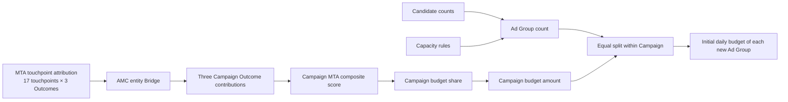

# Current Ad Group Initial-Budget Calculation

## 1. Document Purpose

This document explains in detail how the current `mta_strategy_recommendation` module derives the initial daily budget for each new Ad Group from MTA attribution results.

The current implementation can be stated precisely as follows:

> First use MTA attribution results to calculate budget shares for four Campaigns. Next calculate how many Ad Groups each Campaign needs from candidate counts. Finally split the Campaign budget equally among its new Ad Groups.

The current model therefore does not predict the performance of individual new Ad Groups or calculate different performance scores for new groups in the same Campaign. Its output is a deterministic initial-budget starting point:

```text
recommendation_type = INITIAL_SEED
is_optimized = false
allocation_basis = CAMPAIGN_MTA_EQUAL_SPLIT
```

## 2. Data Used by the Current Calculation

Strategy-model paths in the following table are relative to the `modules/mta_strategy_recommendation` module root; MTA source-data paths are relative to the workspace root.

| Data | Current file | Content entering the calculation |
| --- | --- | --- |
| Strategy request | `data/simulated/strategy_request.json` | Campaign Group daily budget, four Campaigns, Outcome weights, capacity rules, and minimum daily budget per group |
| Candidate pool | `data/simulated/candidate_pool.json` | Eligible Keyword-unit, SKU, valid-Pair, Target, and Audience counts for each Campaign |
| MTA attribution | `../amc_mta/outputs/attribution/amc_mta_recommended_attribution.csv` | `recommended_value` and reliability status for every touchpoint and Outcome |
| AMC entity aggregate | `../mta_attribution/data/simulated/amc_touchpoint_entity_aggregate_sample.csv` | Relationships between touchpoints and historical Campaigns/Ad Groups, plus supporting metrics for the Bridge |
| Canonical result | `outputs/initial_budget_recommendation.json` | Score, count, and budget of four Campaigns, plus each anonymous new group's budget |

The current sample Campaign Group has a daily budget of 1,000 USD and contains four Campaigns:

| Campaign | Ad Product |
| --- | --- |
| `C_DEMO_SP` | Sponsored Products |
| `C_DEMO_SB` | Sponsored Brands |
| `C_DEMO_SD` | Sponsored Display |
| `C_DEMO_DSP` | Amazon DSP |

## 3. Overall Calculation Flow



The entire process can be summarized in one final formula:

```text
Initial daily budget of a new Ad Group
= Campaign Group total daily budget
  × Campaign MTA score / sum of all Campaign MTA scores
  ÷ recommended Ad Group count for that Campaign
```

The following sections explain where every term in this formula comes from.

## 4. Step One: Read the Attribution Value of Each MTA Touchpoint

The MTA file's granularity is:

```text
touchpoint × outcome
```

The current touchpoint is a five-segment combination of advertising attributes:

```text
AD_PRODUCT:FORMAT:PLACEMENT:CREATIVE:INTERACTION_TYPE
```

Three Outcomes are currently used:

- `converted_users`;
- `purchase_count`;
- `revenue`.

Each row uses the MTA output's `recommended_value`:

- when `reliability_status=RELIABLE`, use the point value directly;
- when `reliability_status=UNRELIABLE`, `recommended_value` is `[low,high]`, and the current implementation uses the interval midpoint;
- when an interval midpoint is used, add the `UNRELIABLE_MTA_RANGE_MIDPOINT_USED` warning.

For each Outcome, numeric `recommended_value` values over every available touchpoint must satisfy this condition within a `1e-9` tolerance:

```text
Σ TouchpointRecommendedValue = 1
```

Thus, `recommended_value` represents the Outcome's attribution share across all MTA touchpoints. For an `UNRELIABLE` row, the value included in the sum is the midpoint of `[low,high]`, not the original string.

The current sample has 17 touchpoints and 3 Outcomes, so it reads 51 MTA rows; all 51 are `RELIABLE`.

## 5. Step Two: Bridge to Historical Campaigns through the AMC Entity Table

### 5.1 Why the Bridge Is Needed

MTA touchpoints contain advertising attributes such as Ad Product, Format, Placement, Creative, and Interaction Type. Budget output, by contrast, is organized by Campaign and new Ad Group. The AMC entity-aggregate table identifies the Campaign and historical Ad Group that carried a historical touchpoint.

### 5.2 Allocation within a Touchpoint

For touchpoint `t` and Outcome `o`, the code first finds AMC entity rows satisfying both conditions:

```text
entity.touchpoint = t
entity.campaign_id = Campaign corresponding to the Ad Product
```

It then chooses an allocation metric by Outcome:

| Outcome | First-priority allocation metric |
| --- | --- |
| `converted_users` | `assisted_converted_users` |
| `purchase_count` | `assisted_purchase_count` |
| `revenue` | `assisted_revenue` |

If the sum of the corresponding `assisted_*` metric is zero, weighting falls back in this order:

```text
clicks → impressions → unique_users → equal
```

The touchpoint credit received by one historical entity row is:

```text
EntityCredit(t,o,e)
= MTARecommendedValue(t,o)
  × EntityMetric(e) / Σ MatchingEntityMetric
```

The code first aggregates entity-row credit to historical Ad Group and checks that the touchpoint credit conserves completely:

```text
Σ HistoricalAdGroupCredit(t,o) = MTARecommendedValue(t,o)
```

It then aggregates historical Ad Group credit to Campaign.

### 5.3 The Bridge's Actual Role in the Current Budget

Currently, exactly one Campaign corresponds to each Ad Product. Therefore, after a touchpoint is allocated among historical entities and then aggregated back to Campaign, its total still equals the original MTA attribution value.

The AMC Bridge currently performs three main functions:

1. validates data relationships among MTA touchpoints and historical Campaigns/Ad Groups;
2. records the Campaign's historical Ad Group count, touchpoint count, and allocation methods;
3. guarantees that touchpoint credit is neither lost nor duplicated during aggregation.

Historical Ad Group weights in the Bridge are not passed directly to future new Ad Groups. New groups in the output use new anonymous `ad_group_slot_id` values and are not continuations of historical Ad Groups.

## 6. Step Three: Obtain the Three Outcome Contributions for Each Campaign

For Campaign `c` and Outcome `o`:

```text
CampaignOutcomeContribution(c,o)
= Σ bridged touchpoint credit belonging to Campaign c
```

The current canonical results are:

| Campaign | Converted Users | Purchase Count | Revenue |
| --- | ---: | ---: | ---: |
| SP | 0.242017 | 0.241830 | 0.234920 |
| SB | 0.298984 | 0.299673 | 0.293010 |
| SD | 0.235849 | 0.234967 | 0.231124 |
| DSP | 0.223150 | 0.223530 | 0.240946 |
| Total | 1.000000 | 1.000000 | 1.000000 |

For example, SP's `converted_users=0.242017` means that, in the current MTA results, 24.2017% of attribution credit for converted users aggregates to the SP Campaign after the AMC Bridge.

It does not mean 0.242017 real users, nor is it a prediction of incremental conversions after a budget increase.

## 7. Step Four: Combine Three Outcomes into the Campaign MTA Score

Current input weights are:

```text
converted_users = 0.4
purchase_count  = 0.3
revenue         = 0.3
```

Weights must sum to 1. The Campaign composite score is:

```text
CampaignMTAScore
= 0.4 × ConvertedUsersContribution
+ 0.3 × PurchaseCountContribution
+ 0.3 × RevenueContribution
```

For SP:

```text
SP Campaign MTA Score
= 0.4 × 0.242017
+ 0.3 × 0.241830
+ 0.3 × 0.234920
= 0.0968068 + 0.0725490 + 0.0704760
= 0.2398318
```

The four Campaign results are:

| Campaign | Result |
| --- | ---: |
| SP | 0.2398318 |
| SB | 0.2973985 |
| SD | 0.2341669 |
| DSP | 0.2286028 |
| Total | 1.0000000 |

Because Campaign contributions sum to 1 for each Outcome and Outcome weights also sum to 1, the current `campaign_score_total=1.0`.

## 8. Step Five: Convert Campaign Scores to Budget Shares

The Campaign budget share is:

```text
CampaignBudgetShare
= CampaignMTAScore / Σ AllCampaignMTAScore
```

The current total score equals 1 exactly, so each Campaign's budget share is numerically equal to its MTA composite score:

| Campaign | Campaign budget share | Percentage |
| --- | ---: | ---: |
| SP | 0.2398318 | 23.98318% |
| SB | 0.2973985 | 29.73985% |
| SD | 0.2341669 | 23.41669% |
| DSP | 0.2286028 | 22.86028% |
| Total | 1.0000000 | 100% |

The Campaign Group total daily budget is 1,000 USD, so:

```text
CampaignBudget = CampaignBudgetShare × 1,000
```

This produces:

| Campaign | Campaign initial daily budget (displayed to 4 decimal places) |
| --- | ---: |
| SP | 239.8318 USD |
| SB | 297.3985 USD |
| SD | 234.1669 USD |
| DSP | 228.6028 USD |
| Total | 1,000.0000 USD |

## 9. Step Six: Calculate How Many Ad Groups Each Campaign Needs

MTA scores do not determine the Ad Group count; candidate counts and capacity rules do.

### 9.1 SP and SB

Search ad products use:

```text
N = max(
  min_ad_groups,
  ceil(eligible_keyword_unit_count / max_keyword_units_per_ad_group),
  ceil(eligible_sku_count / max_skus_per_ad_group),
  ceil(eligible_legal_pair_count / max_legal_pairs_per_ad_group)
)
```

Current SP:

```text
N = max(1, ceil(3/50), ceil(3/20), ceil(3/100))
  = max(1, 1, 1, 1)
  = 1
```

Current SB:

```text
N = max(1, ceil(4/50), ceil(4/20), ceil(4/100))
  = 1
```

### 9.2 SD and DSP

Display ad products use:

```text
N = max(
  min_ad_groups,
  ceil(eligible_sku_count / max_skus_per_ad_group),
  ceil(eligible_target_count / max_targets_per_ad_group),
  ceil(eligible_audience_count / max_audiences_per_ad_group)
)
```

Current SD:

```text
N = max(1, ceil(4/20), ceil(4/50), ceil(2/50))
  = 1
```

Current DSP:

```text
N = max(1, ceil(4/20), ceil(8/50), ceil(2/50))
  = 1
```

The current output is therefore:

```text
SP / SB / SD / DSP = 1 / 1 / 1 / 1 new Ad Groups
```

This is the capacity lower bound and initial count recommendation derived from aggregate candidate counts. There are currently no specific candidate entities or new-group assignments, so this count does not prove that all valid Pairs will necessarily fit into these groups under real grouping constraints.

If any capacity calculation exceeds `max_ad_groups`, the input is rejected rather than truncated to the maximum.

## 10. Step Seven: Split Equally among New Ad Groups within Each Campaign

The current candidate pool contains only counts of Keywords, SKUs, Targets, Audiences, and similar objects. It contains no specific candidate IDs and no mapping between candidates and future `ad_group_slot_id` values.

New groups in the same Campaign therefore have no features that the current model can use to distinguish their budgets. The code uses a strict equal split:

```text
AdGroupBudgetShare = CampaignBudgetShare / RecommendedAdGroupCount

AdGroupInitialDailyBudget
= AdGroupBudgetShare × CampaignGroupTotalDailyBudget
```

Equivalently:

```text
AdGroupInitialDailyBudget
= CampaignBudget / RecommendedAdGroupCount
```

All four current Campaigns have one new group, so each new-group budget equals its Campaign budget:

| New Ad Group Slot | Campaign | Initial budget share | Initial daily budget (displayed to 4 decimal places) |
| --- | --- | ---: | ---: |
| `C_DEMO_SP_NEW_AG_01` | SP | 0.2398318 | 239.8318 USD |
| `C_DEMO_SB_NEW_AG_01` | SB | 0.2973985 | 297.3985 USD |
| `C_DEMO_SD_NEW_AG_01` | SD | 0.2341669 | 234.1669 USD |
| `C_DEMO_DSP_NEW_AG_01` | DSP | 0.2286028 | 228.6028 USD |

### 10.1 Calculation with Multiple New Groups

Suppose SP candidate counts cross a capacity boundary and the recommendation becomes two groups while its MTA score and the Campaign Group total budget remain unchanged:

```text
SP Campaign budget = 239.8318 USD
Budget per new SP Ad Group = 239.8318 / 2 = 119.9159 USD
```

Both new groups receive the same budget. The model does not fabricate a budget difference merely because an anonymous number is `NEW_AG_01` versus `NEW_AG_02`.

## 11. How the Minimum Budget Affects Results

The current `minimum_daily_budget_per_ad_group` is 25 USD for every Ad Product.

The Campaign's minimum executable budget is:

```text
MinimumRequiredCampaignBudget
= RecommendedAdGroupCount × MinimumDailyBudgetPerAdGroup
```

Each current Campaign has one group, so its minimum executable daily budget is 25 USD. All four Campaign allocations exceed 25 USD, so every status is:

```text
execution_status = EXECUTABLE
```

The minimum budget currently checks execution status only. If a Campaign's allocation is insufficient, the model:

- retains the Ad Group count calculated from capacity rules;
- retains the original budget allocation;
- marks `INSUFFICIENT_BUDGET_FOR_MINIMUMS`;
- does not automatically reduce the Ad Group count or transfer budget from other Campaigns.

## 12. Result without a Total Budget

If the input omits `campaign_group.total_daily_budget`, the model can still calculate:

- relative Campaign budget shares;
- the recommended Ad Group count for each Campaign;
- the relative budget share of each new Ad Group.

It does not output:

- `budget_seed_total`;
- `campaign_budget_seed`;
- `initial_daily_budget`;
- `minimum_required_daily_budget`.

It also adds:

```text
NO_BUDGET_BASELINE_RELATIVE_SHARES_ONLY
```

## 13. Budget Conservation Relationships

The current generator and validator check:

```text
Σ touchpoint MTA attribution shares for each Outcome = 1
Σ Campaign budget shares = 1
Σ Ad Group budget shares within Campaign = Campaign budget share
Σ all Ad Group budget shares = 1
Σ Campaign budget amounts = Campaign Group total budget
Σ Ad Group budget amounts within Campaign = Campaign budget amount
```

Budget amounts of the four new groups in the current output sum to:

```text
239.8318 + 297.3985 + 234.1669 + 228.6028
= 1,000.0000 USD
```

JSON stores the original Python floating-point values, so a field may appear as `234.16689999999994`. This is a floating-point representation effect; the current version does not round to the currency's smallest unit or redistribute remainders.

## 14. How to Read an Ad Group Output

Using the new SP group as an example:

```json
{
  "ad_group_slot_id": "C_DEMO_SP_NEW_AG_01",
  "allocation_basis": "CAMPAIGN_MTA_EQUAL_SPLIT",
  "budget_seed_share": 0.23983179999999998,
  "initial_daily_budget": 239.8318
}
```

Field meanings:

| Field | Meaning |
| --- | --- |
| `ad_group_slot_id` | Anonymous new-group slot for the next activation, not a historical Ad Group ID |
| `allocation_basis` | First calculate the Campaign budget from MTA, then split equally within Campaign |
| `budget_seed_share` | The new group's share of the Campaign Group total budget |
| `initial_daily_budget` | Initial daily-budget amount for the new group |

## 15. What the Current Calculation Does Not Do

To avoid misinterpretation, the current budget boundaries are explicit:

- It does not predict conversions, purchases, or revenue for each new Ad Group.
- It does not score new groups individually using specific Keywords or SKUs.
- It does not treat historical Ad Groups directly as future new Ad Groups.
- It does not estimate marginal return from one more dollar of budget.
- It does not search for the highest ROI or a mathematically optimal budget.
- It does not output specific Keyword, SKU, Match Type, Target, or Audience activation plans.

The real source of each current Ad Group budget is therefore:

```text
MTA determines relative budgets among Campaigns
+ candidate counts determine the new-group count in each Campaign
+ the budget is split equally within each Campaign
```

This is the full meaning of the output field `CAMPAIGN_MTA_EQUAL_SPLIT`.

## 16. Corresponding Code and Result Locations

- Core calculation: `src/budget_recommender.py`
- Generation entry point: `script/generate_initial_budget.py`
- Strategy input: `data/simulated/strategy_request.json`
- Candidate counts: `data/simulated/candidate_pool.json`
- Canonical output: `outputs/initial_budget_recommendation.json`
- Automated validation: `src/hierarchy_validator.py`
