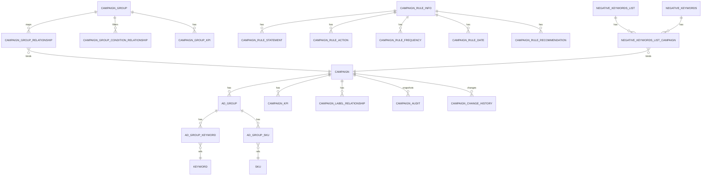

# Campaign 数据结构分析

> 物化形态：核心实体表 + 关系表 + 审计/历史表 + 时序指标分区表 + 业务视图
> 文档目的：这套 schema 围绕 **Campaign（投放活动）** 这一中心实体进行整理，方便后续业务/接口/分析侧引用。

---

## 1. 总体结构（一图速览）

```
                            ┌────────────────────────────────┐
                            │        campaign_group          │
                            │ (PSO / Standalone 业务分组)    │
                            └───────────────┬────────────────┘
                                            │ 1:N
              ┌─────────────────────────────┼─────────────────────────────┐
              │                             │                             │
              ▼                             ▼                             ▼
campaign_group_condition_relationship  campaign_group_relationship  campaign_group_kpi
(分组生效维度：fy/retailer/market…)     (group ↔ campaign 多对多)    (分组级 KPI)

                                            │
                                            ▼
   ┌──────────────────────────────────────────────────────────────────────────┐
   │                                  campaign                                │
   │  广告活动主表：name / fiscal_year / start_end / sponsored_ads / status    │
   └───────────────┬────────────────────────────────┬─────────────────────────┘
                   │ 1:N                            │ 1:N
                   ▼                                ▼
              ad_group                       campaign_kpi / campaign_label_relationship
            (广告组主表)                       campaign_rule_info (优化规则)
                   │
   ┌───────────────┼───────────────┐
   │               │               │
   ▼               ▼               ▼
ad_group_keyword  ad_group_sku    ad_group_audit
   │                │
   ▼                ▼
 keyword           sku
 keyword_categorization / keyword_traffic / keyword_traffic_stats
 keyword_sku_eiroas

                                指标层（按日期 Range 分区）
   ┌────────────────────────────────────────────────────────────────────┐
   │  paid_search_traffic   paid_search_conversion   paid_search_metrics │
   │  campaign_spend        daily_item_spots         campaign_profit     │
   └────────────────────────────────────────────────────────────────────┘

                                视图层（对外读取入口）
   ┌────────────────────────────────────────────────────────────────────┐
   │  vw_group_campaign_adgroup     vw_campaign_metadata                 │
   │  vw_campaign_group_metadata    vw_campaign_kpi_metrics              │
   │  vw_sku_keyword_kpi_metrics                                         │
   └────────────────────────────────────────────────────────────────────┘
```

---

## 2. 实体分层与表清单

| 分层 | 作用 | 代表表 |
|---|---|---|
| 业务分组层 | 把 campaign 按 fy + retailer + market + category 等维度成组管理（PSO / Standalone） | `campaign_group` / `campaign_group_relationship` / `campaign_group_condition_relationship` / `campaign_group_kpi` / `campaign_group_history` / `campaign_group_kpi_history` / `campaign_group_daily_live_time_history` |
| 广告主体层 | Campaign / AdGroup / Keyword / SKU 四元结构（行业标准模型） | `campaign` / `ad_group` / `ad_group_keyword` / `ad_group_sku` / `keyword` / `sku` |
| 维度补充层 | Keyword 分类、流量、增量；KPI 字典 | `keyword_categorization` / `keyword_traffic` / `keyword_traffic_stats` / `keyword_sku_eiroas` / `campaign_kpi` / `campaign_kpi_history` |
| 规则与优化层 | Campaign rule 引擎（条件 + 动作 + 频率 + 推荐结果） | `campaign_rule_info` / `campaign_rule_statement` / `campaign_rule_action` / `campaign_rule_frequency` / `campaign_rule_date` / `campaign_rule_relationship` / `campaign_rule_recommendation` / `campaign_rule_history` |
| 标签层 | Campaign 业务标签（两级） | `campaign_label` / `campaign_label_relationship` |
| 负关键词层 | Negative keyword 清单 + 投放失败记录 | `negative_keywords` / `negative_keywords_list` / `negative_keywords_list_campaign` / `negative_keywords_failure_records` |
| 关键词长尾挖掘 | Keyword harvesting / 深度抓取批次跟踪 | `keyword_harvesting_batch_tracking` / `keyword_deep_scrape_history` |
| 审计 / 快照层 | 投放结构与变更全量留痕 | `campaign_audit` / `ad_group_audit` / `campaign_change_history` / `campaign_scope_daily_snapshot` |
| 上传缓冲层 | Walmart 批量上传中间态 + 通用上传记录 | `walmart_campaign_tmp` / `walmart_ad_group_tmp` / `walmart_keyword_tmp` / `campaign_upload_record` |
| 指标时序层（按月分区） | 流量、转化、整体指标、消耗、广告位 | `paid_search_traffic` / `paid_search_conversion` / `paid_search_metrics` / `daily_item_spots` / `campaign_spend` / `campaign_profit` |
| 集成日志层 | 跨服务调用流水 | `integration_api_call_log` |
| 视图层 | 对外读取入口，封装常用 join 与衍生指标 | `vw_group_campaign_adgroup` / `vw_campaign_metadata` / `vw_campaign_group_metadata` / `vw_sku_keyword_kpi_metrics` / `vw_campaign_kpi_metrics` |
| 其他 | 分布式锁、预算计划、沙盒等 | `shedlock` / `budget_allocation_plan_campaign` / `sandbox_data_test_only` |

---

## 3. 核心表字段说明

### 3.1 `campaign`（广告活动主表）

| 字段 | 类型 | 含义 |
|---|---|---|
| `id` | `int PK`（`campaign_id_seq`） | 内部主键 |
| `name` | `varchar(255) NOT NULL` | 活动名称 |
| `fiscal_year` | `varchar(255) NOT NULL` | 财年（业务划分维度） |
| `start_date` / `end_date` | `date` | 投放周期；`end_date` 可空表示长期有效 |
| `sponsored_ads` | `varchar(255) NOT NULL` | 广告类型，例如 `sponsored product` / `sponsored brand`（参见 `vw_campaign_metadata` 中 `algo_supported` 判断） |
| `sponsored_ads_sub_type` | `varchar` | 子类型，例如 `PRODUCT_COLLECTION` |
| `targeting` | `varchar(255) NOT NULL` | `MANUAL` / `AUTO` |
| `target_object_type` | `varchar` | 例如 `KEYWORD` |
| `retailer_id` / `market_id` | `int NOT NULL` | 零售商 / 市场维度 |
| `account_id` | `varchar` | 账户 ID |
| `managed_by_search_planner` | `bool NOT NULL` | 是否由 Search Planner 接管（PSO 关键开关） |
| `api_id` | `varchar(255) NOT NULL` | 外部平台 ID（Amazon / Walmart 等） |
| `ers_id` | `varchar` | ERS 外部 ID |
| `status` | `varchar` | 平台状态（如 `enabled` / `paused` 等） |
| `status_updated_at` | `timestamptz` | 状态更新时间 |
| `paused_type` | `varchar` | 暂停原因；`comment: mark the cause of paused` |

关键索引：
- `idx_campaign_criteria` / `idx_campaign_criteria_3`：覆盖常用筛选组合（status + retailer + sponsored_ads + targeting…）
- `idx_campaign_targeting_dates`：偏分索引，仅在 `targeting='MANUAL'` 下生效，配合 `vw_campaign_metadata` 中的 `MANUAL` 过滤
- `ix_campaign_fiscal_year` / `ix_campaign_market_id` / `ix_campaign_retailer_id`：维度过滤

### 3.2 `ad_group`（广告组）

| 字段 | 类型 | 含义 |
|---|---|---|
| `id` | `int PK` | 主键 |
| `campaign_id` | `int FK → campaign.id` | 所属 campaign |
| `name`, `api_id`, `ers_id`, `status`, `status_updated_at` | — | 同 campaign 语义 |
| `managed_by_search_planner` | `bool` | 是否纳入 PSO |
| `min_cpc` / `max_cpc` | `numeric(10,2) DEFAULT 0.00` | 出价边界（V20260311102442、V20260313135945 引入并扩展到视图） |

> ⚠️ FK 仅在 `ad_group.campaign_id → campaign.id` 上存在，其余表（如 `ad_group_keyword`、`ad_group_sku`）都是“逻辑外键 + 索引”而非数据库外键约束，写入需要应用侧自行保证一致性。

### 3.3 关联表 `ad_group_keyword` / `ad_group_sku`

```
ad_group_keyword(ad_group_id, keyword_id, keyword_api_id, status, match_type, status_updated_at)
ad_group_sku   (ad_group_id, sku_id,     product_api_id, status, status_updated_at)
```

特征：
- 无主键，依赖 `(ad_group_id, keyword_id)` / `(ad_group_id, sku_id)` 的应用语义唯一。
- 通过 `status` 字段维护启用关系（视图中只取 `enabled`）。
- `match_type` 仅在 keyword 关系上，存 `BROAD/PHRASE/EXACT` 等。

### 3.4 维度表 `keyword` / `sku`

- `keyword(id, value)`：纯关键词字典，`value` 加索引便于反查。
- `sku(id, retailer_id, market_id, value, product_*)`：包含产品分类/品牌/细分/层级等冗余，便于和 `keyword_categorization` 一同支持算法过滤；其中 `scope_for_search_optimization` 标识 SKU 是否纳入搜索优化范围。

### 3.5 业务分组 `campaign_group` 家族

主表 `campaign_group`：
- 基本字段：`group_name`、`primary_kpi_*`、`secondary_kpi_*`、`sort_number`、`parent_id`（自引用，做二层结构）。
- 业务开关：
  - `auth_id`（来自 AutoBidder）；
  - `group_status`（`Active`/`Paused`）；
  - `rule_type`（V20260208000000 引入）：`null = PSO mode`，`非空 = Standalone mode`；
  - `sp_active`（V20260311103024 引入）：Search Planner 是否激活，默认 `false`。

辅助表：
- `campaign_group_condition_relationship`：定义 group 命中规则（`category_id / brand_id / segment_id / retailer_id / market_id / fiscal_year`），驱动哪些 campaign 自动归属。
- `campaign_group_relationship`：保存 group → campaign 的实际多对多关系，是视图 `vw_group_campaign_adgroup` 的核心 join 表。
- `campaign_group_kpi` / `campaign_group_daily_live_time_history` / `campaign_group_kpi_history`：分别记录当前分组级 KPI、日级在线时长、KPI 历史快照（带 `roas/sov/cpc/daily_avg_budget/time_live/daily_budget_needed` 等指标）。
- `campaign_group_history`：分组配置历史（含 `campaign_ids` 串）。

### 3.6 KPI 与规则

- `campaign_kpi`：campaign 维度的 primary/secondary KPI，含 `category/brand/market/retailer/segment/fiscal_year` 五维。
- `campaign_kpi_history`：每次变更生成一条快照，额外带 `start_date / end_date / status`，可串成时间线。
- `campaign_rule_info`：规则定义入口，字段语义见列注释：
  - `rule_category`：`TARGETING / PLACEMENT / PRODUCT_IDENTIFIER`
  - `status`：`ACTIVE / INACTIVE / ARCHIVED`
  - `apply_level`：`CAMPAIGN / BRAND / CAMPAIGN_GROUP / LABEL`
  - `rule_relation`：`Keyword / PAT / Keyword & PAT / ASIN/SKU`
- 配套子表：
  - `campaign_rule_statement`（条件三元组：metrics/comparison/value）
  - `campaign_rule_action`（满足条件后的动作 + target）
  - `campaign_rule_frequency`（运行周期与数据窗口）
  - `campaign_rule_date`（`DATE_RANGE` / `EXCLUDE_DATE`）
  - `campaign_rule_relationship`（rule 与外部实体的挂载）
  - `campaign_rule_recommendation`：每次跑出来的推荐值（`current_value` vs `recommendation_value`，是否被采纳 `optimize_indicator`）
  - `campaign_rule_history`：每日跑批 KPI 快照（`impressions/sales/roas/cpc/cvr/clicks/sov` + 是否执行 `execute`）

### 3.7 时序指标层

| 表 | 分区策略 | 主要字段 | 备注 |
|---|---|---|---|
| `paid_search_traffic` | `RANGE(date)`，按月，2022–2029 已建分区 | `campaign_id`, `ad_group_id`, `keyword_id`, `sku_id`, `impressions`, `clicks`, `budget`, `date_timezone`, `*_api_id` | 流量/花费明细，按月做 covering 索引（`idx_paid_search_traffic_covering`） |
| `paid_search_conversion` | 同上 | `sales`, `unit_sales` | 转化明细 |
| `paid_search_metrics` | 同上（2022–2026 月级，2025 整年合并） | 综合：流量 + 转化 | 历史综合表，部分查询替代用 |
| `campaign_spend` | 普通表（非分区） | `campaign_id`, `budget`, `date_timezone` | 平台口径花费（与 traffic.budget 区分） |
| `campaign_profit` | 普通表 | `total_profit` | 利润口径 |
| `daily_item_spots` | `RANGE(date)`，2025–2029 月级 | `keyword_id`, `sku_id`, `item_spots`, `total_spots`, `ad_type` | SOV/位置类指标 |

> 设计要点：所有时序表的主分区键都是 `date`，新分区需要按月预创建（见 V20250724141042 类历史脚本）。`paid_search_*` 没有主键，是经典的 append-only fact table。

### 3.8 审计 / 快照 / 变更

- `campaign_audit` / `ad_group_audit`：每日 ETL 把当前 campaign 与 ad_group 完整属性（含 `attr_hash` 用于幂等去重）落表，`created_by` 默认 `etl`。
- `campaign_change_history`：捕获 campaign 维度的变更（含 `success / error_message`，便于排障）。
- `campaign_scope_daily_snapshot`：按日记录 group 范围内的 campaign 集合（带 `batch_id`），是 `vw_*` 校验数据漂移的基础。
- `campaign_upload_record`：来自上传链路的明细，覆盖 SB/SP/SD/SBV 各种字段（`ads_name / brand_name / brand_logo_asset_id / click_url …`）。

### 3.9 负关键词

```
negative_keywords_list ── 1:N ──> negative_keywords_list_campaign ── N:1 ── campaign
                                                    │
                                                    └── N:1 ── negative_keywords
negative_keywords_failure_records                                  ← 投放失败原因记录
```

### 3.10 Keyword Harvesting（长尾挖掘）

- `keyword_harvesting_batch_tracking`：批次状态机（`phase_status`、`depends_on[]`、`relation`、blob URL），代表一次挖掘流程。
- `keyword_deep_scrape_history`：底层抓取明细，按 `batch_id` 关联回上面的批次。

---

## 4. 视图（对外读取入口）

| 视图 | 作用 | 关键关注点 |
|---|---|---|
| `vw_group_campaign_adgroup` | group → campaign → ad_group 一行展开，**仅当前在投** `start_date <= today AND (end_date >= today OR null)` | 已纳入 `rule_type`、`min_cpc/max_cpc` |
| `vw_campaign_group_metadata` | group 维度元数据（fy/retailer/market/category + group_name + campaign_id） | 加 `row_number()` 便于分页 |
| `vw_campaign_metadata` | campaign × ad_group × keyword × sku 全四元展开，**MANUAL + 在投 + 启用** 才纳入 | 提供 `algo_supported`（SP/SB+KEYWORD+PRODUCT_COLLECTION）与 `valid_for_pso`、`active_for_pso` 计算列 |
| `vw_sku_keyword_kpi_metrics` | `paid_search_traffic ∪ paid_search_conversion` 按 (date, campaign, ad_group, sku, keyword) 聚合 | 衍生 `roas/cvr/cpc`，零除用 `NULLIF` 兜底 |
| `vw_campaign_kpi_metrics` | campaign 维度日级 KPI（融合 traffic / conversion / campaign_spend） | 同样有 `roas/cvr/cpc`；`traffic_spend` 与 `campaign_spend` 并存，业务报表注意口径差异 |

> 所有视图都以 `pgadmin` 为 owner，没有物化（不是 materialized view），读取压力直接打到底表，注意结合分区与索引使用。

---

---

## 6. 设计与使用要点

### 6.1 数据完整性
- DB 级 FK 极少（仅 `ad_group.campaign_id → campaign.id`）；其它都是“逻辑外键 + 索引”，**写入必须走应用层校验**。
- 关系表 `ad_group_keyword` / `ad_group_sku` **无主键**，重复关系完全靠应用约束。
- `keyword`、`sku` 是字典，被多张 fact / relation 引用，更新需谨慎（不能直接修改 `value`，否则会污染历史）。

### 6.2 状态语义
所有 4 层（`campaign.status` / `ad_group.status` / `ad_group_keyword.status` / `ad_group_sku.status`）都必须为 `enabled` 才算“活跃可投”，`vw_campaign_metadata.active_for_pso` 表达了这层语义，下游引用请直接走视图，避免重复实现。

### 6.3 时序与分区
- 写入分区表时 `date` 必须落在已创建的分区范围内，否则会报 `no partition of relation ...`。
- 历史月度分区已经覆盖到 2029（traffic/conversion）与 2026（metrics）；新年初投产前需要预先添加 `paid_search_metrics_YYYY_MM` 分区。
- `paid_search_traffic` / `paid_search_conversion` 都有多个 covering 索引；若发现慢查询，**优先复用已有 covering**，不要随手再加单列索引（写放大成本高）。

### 6.4 业务两口径要分清
- `traffic_spend`（来自 `paid_search_traffic.budget`） vs `campaign_spend`（来自 `campaign_spend.budget`）：前者是明细聚合，后者是平台日级口径，二者通常不完全一致。
- `paid_search_metrics`（历史综合表）与 `paid_search_traffic + paid_search_conversion`（拆分表）并存，新业务建议统一走拆分表 + 视图。

### 6.5 算法可用判定（`vw_campaign_metadata.algo_supported`）
当且仅当：
- `sponsored_ads = 'sponsored product' AND target_object_type = 'KEYWORD'`，或
- `sponsored_ads = 'sponsored brand' AND target_object_type = 'KEYWORD' AND sponsored_ads_sub_type = 'PRODUCT_COLLECTION'`

PSO 走的就是这套条件 + `managed_by_search_planner = true`（campaign 与 ad_group 都必须为 true）。

### 6.6 与外部系统映射
- 与零售商平台：通过 `api_id` 字段（campaign / ad_group / ad_group_keyword(keyword_api_id) / ad_group_sku(product_api_id)）对接。
- 与 AutoBidder：`campaign_group.auth_id`。
- 与 ERS：`campaign.ers_id` / `ad_group.ers_id`。
- 与算法/AIF：`keyword_harvesting_batch_tracking.instruction_blob_url` / `biddable_keywords` 持有 JSON 结构。

---

## 7. ER 速记图（核心子集）



---
