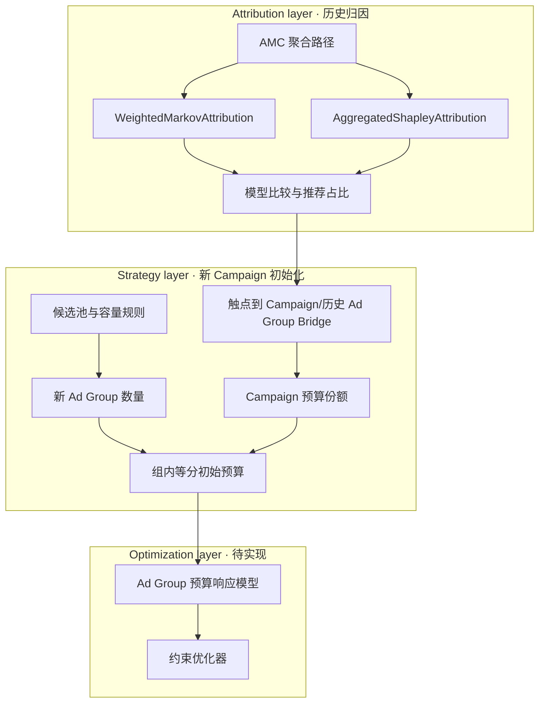

# 项目结构与数据流

## 模型架构 

## 目录职责 

| 目录 | 项目职责 | 关键入口 |
| --- | --- | --- |
| `modules/amc_mta/` | 构建聚合路径、运行两种归因模型、比较并发布推荐归因 | `run_pipeline.py`、`src/amc_mta_attribution.py` |
| `modules/mta_strategy_recommender/` | 将触点归因桥接到 Campaign，计算新 Ad Group 数量和初始预算 | `src/budget_recommender.py` |
| `docs/` | 当前 VitePress 文档、Cloudflare 配置和研究附件 | 本站 |
| `docs/research/` | 外部研究 PDF、报告和索引；仅在相关页面中引用，不参与模型运行 | 研究附件 |
| `design-artifacts/` | 历史 Product Brief、产品需求文档和决策记录 | 追溯材料 |
| `_bmad-output/` | 已完成或延后的规格与实施记录 | 追溯材料 |
| `.agents/`、`_bmad/` | 本地开发工作流工具 | 不参与模型运行 |

## 数据管线 

| 阶段 | 输入 | 处理 | 输出 |
| --- | --- | --- | --- |
| 路径准备 | 合成事件、Amazon Ads 风格日报 | 构建匿名聚合五段路径 | AMC 路径报告、触点实体聚合 |
| 归因 | 聚合路径 | Markov 移除效应、Path-level Shapley | 两份模型结果 |
| 治理 | 两份模型结果 | 有效性、支持度和一致性检查 | 推荐归因、比较摘要 |
| 策略初始化 | 推荐归因、实体 Bridge、候选计数、预算 | Campaign 评分、容量计算、组内等分 | 初始预算 JSON |
| 优化（规划） | Ad Group 特征、历史表现、预算候选值 | 单一响应模型 + 约束搜索 | 收入目标下的预算方案 |

归因层与策略层通过 `amc_mta_recommended_attribution.csv` 和 `amc_touchpoint_entity_aggregate_sample.csv` 连接。策略层不会把历史 Ad Group 直接当作未来的新 Ad Group。
