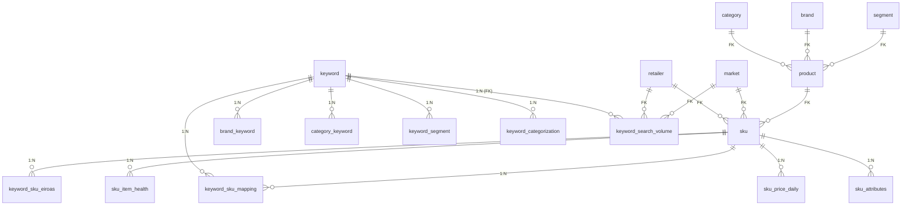

# Product 数据模型分析（msproduct）


> 文档目的：把 product 的 schema 按主数据 + 关系 + 长尾指标 + 时序分区 + 业务约束分层整理，方便上下游对齐。

---

## 1. 总体结构（一图速览）

```
                                 主数据层（维度）
   ┌──────────────────────────────────────────────────────────────────────┐
   │  retailer   market   category   brand   segment                      │
   │     │         │         │         │        │                          │
   │     └─────────┴───── FK ─┴─────────┴────────┘                        │
   └──────────────────────────────────────────────────────────────────────┘
                                       │
                                       ▼
                                    product            (gtin 唯一)
                                       │
                                       ▼
                                      sku              (retailer + market + value 唯一)
                                       │
                       ┌───────────────┼───────────────┐
                       ▼               ▼               ▼
                  sku_attributes   sku_price_daily   sku_item_health
                                       (非时序)         (按日，非分区)

                                关键词与分类
   ┌──────────────────────────────────────────────────────────────────────┐
   │  keyword (value 唯一, paid-search-to-bid 开关 + 触发器)               │
   │     │                                                                 │
   │     ├── brand_keyword       (keyword ↔ brand)                         │
   │     ├── category_keyword    (keyword ↔ category)                      │
   │     ├── keyword_segment     (keyword ↔ segment)                       │
   │     ├── keyword_categorization (复合分类 + group_id)                  │
   │     ├── keyword_sku_mapping (keyword ↔ sku + priority)                │
   │     └── keyword_sku_eiroas  (sku × keyword × date)                    │
   └──────────────────────────────────────────────────────────────────────┘

                                长尾流量与搜索量
   ┌──────────────────────────────────────────────────────────────────────┐
   │  keyword_traffic            (seed_keyword → keyword 30d 精确曝光)     │
   │  keyword_traffic_stats      (按 seed_keyword 月度聚合)                │
   │  search_volume_monthly      (按 keyword × month)                      │
   │  keyword_search_volume      (group 维度，含 FK，PK 复合)              │
   │  keyword_impressions        (按月分区，记录 organic 曝光)             │
   │  keyword_sku_rank           (按月分区，记录 SKU 在该 keyword 下排名) │
   │  keyword_sku_daily_webscraping (按月分区，抓取的 item_spots)         │
   └──────────────────────────────────────────────────────────────────────┘

                                市场份额（与 product 配合）
   ┌──────────────────────────────────────────────────────────────────────┐
   │  market_share (year_month + category + brand + retailer + market)    │
   └──────────────────────────────────────────────────────────────────────┘
```

---

## 2. 实体分层与表清单

| 分层 | 作用 | 代表表 |
|---|---|---|
| 维度主数据 | 全局 ID 字典，承担最强的外键约束 | `retailer` / `market` / `category` / `brand` / `segment` |
| 产品主数据 | 产品-SKU 两层结构 | `product` / `sku` |
| SKU 属性 / 价格 / 健康度 | SKU 衍生属性与单一指标 | `sku_attributes` / `sku_price_daily` / `sku_item_health` |
| 关键词主数据 | 关键词 + 是否纳入 paid search 投放 | `keyword` |
| 关键词关系 | 与 brand/category/segment/sku 的多对多 | `brand_keyword` / `category_keyword` / `keyword_segment` / `keyword_sku_mapping` |
| 关键词分类 | 按 retailer × market × category × brand 维度的搜索类型标签 + group | `keyword_categorization` |
| 关键词流量 / 搜索量 | 内部抓取 + 外部搜索量 | `keyword_traffic` / `keyword_traffic_stats` / `search_volume_monthly` / `keyword_search_volume` |
| 长尾时序（按月分区） | 抓取/曝光/排名等 ETL 写入数据 | `keyword_impressions` / `keyword_sku_daily_webscraping` / `keyword_sku_rank` |
| 增量 ROAS | SKU × keyword × date 的 eiroas / incrementality | `keyword_sku_eiroas` |
| 市场份额 | 月度 ms 指标 | `market_share` |
| 触发器 | 处理 keyword/sku 投放开关变化时的清理 | `keyword_cleanup_keyword_sku_mapping_on_updated` / `sku_cleanup_keyword_sku_mapping_on_updated` |

---

## 3. 核心表字段说明

### 3.1 维度主数据（`retailer` / `market` / `category` / `brand` / `segment`）

统一模式：
```
id    int PK (sequence)
code  varchar NOT NULL UNIQUE
name  varchar
[source  varchar(255)]   # 仅 category / market / retailer 有
```
- `code` 是稳定业务键，跨服务也以 `code` 互通；`source` 标识维度来源系统（典型值是上游主数据治理系统）。
- `category` 的 `source` 字段是后续维度治理引入的；`brand`、`segment` 没有 `source`。

### 3.2 `product`

| 字段 | 类型 | 含义 |
|---|---|---|
| `id` | `int PK` | 内部主键 |
| `gtin` | `varchar NOT NULL UNIQUE` | 全球商品条码，业务键 |
| `category_id` | `int FK → category.id` | |
| `brand_id` | `int FK → brand.id` | |
| `segment_id` | `int FK → segment.id` | |
| `source_system_code` | `varchar` | 上游来源 |
| `tier` | `varchar` | 产品等级（如 priority/tail） |

> `product` 通过 `gtin` 唯一锁定，且对 `category/brand/segment` 都建立了 **真实数据库外键**——这是整个 ISS 中外键约束最严格的一张表。

### 3.3 `sku`

| 字段 | 类型 | 含义 |
|---|---|---|
| `id` | `int PK` | 内部主键 |
| `retailer_id` | `int FK → retailer.id` | 必填 |
| `market_id` | `int FK → market.id` | 可空 |
| `value` | `varchar NOT NULL` | 平台侧 SKU/ASIN 实际值 |
| `product_id` | `int FK → product.id` | 关联到 `product`（必填） |
| `description` | `varchar` | 标题 |
| `scope_for_search_optimization` | `bool` | 是否纳入搜索优化范围 |
| `specification_profit` | `numeric(18,2)` | 利润口径配置 |
| `specification_for_paid_search_to_bid` | `bool` | 是否参与 paid search 投放（与 `keyword.specification_for_paid_search_to_bid` 对偶） |
| `specification_updated_at` | `timestamp` | 上面这两个 specification 字段的最后更新时间 |

唯一约束：`UNIQUE(retailer_id, market_id, value)` — 同一零售商 + 市场下 SKU 值不重复。

### 3.4 `sku_attributes` / `sku_price_daily` / `sku_item_health`

- `sku_attributes`：键值结构 `(sku_id, name, value, source)`，支持多来源；索引 `(sku_id, attribute_name, attribute_source)`。
- `sku_price_daily`：`(sku_id, date, price, price_currency, store_country)`，**没有主键**，靠应用层与索引 `(sku_id)`、`(date)` 保证查询效率；货币字段精度 `numeric(38,10)`。
- `sku_item_health`：`(date, sku_id, item_health numeric(8,2))`，按日打点 SKU 健康度（无分区）。

### 3.5 `keyword` 与关系表

`keyword`：
- `id PK`，`value UNIQUE`。
- 业务开关：`specification_for_paid_search_to_bid (bool)` + `specification_updated_at`。
- **触发器** `keyword_cleanup_keyword_sku_mapping_on_updated`：每次该字段 UPDATE 都会触发存储过程，清理 `keyword_sku_mapping` 中失效记录（`sku` 上的同名触发器逻辑对偶）。这是 schema 中少有的“通过触发器维持一致性”的地方，应用层修改时需要注意副作用。

关系（`keyword_id NOT NULL + 维度 id NOT NULL`，无主键、不带 FK）：
- `brand_keyword(keyword_id, brand_id)`
- `category_keyword(keyword_id, category_id)`
- `keyword_segment(keyword_id, segment_id)`

带主键、带优先级：
- `keyword_sku_mapping(id PK, keyword_id, sku_id, priority)`：手动维护 keyword → sku 的优先级。

### 3.6 `keyword_categorization`（关键词分类核心表）

```
category_id            int NOT NULL
brand_id               int
retailer_id            int NOT NULL
market_id              int NOT NULL
keyword_id             int NOT NULL
representative_keyword_id int   -- ISS-13203 改为可空
search_volume_tag      text NOT NULL
search_branding_tag    text NOT NULL
search_conquest_tag    text
group_id               bigint DEFAULT 0   -- V20251225133716 引入
```
关键点：
- 没有主键。索引覆盖 `(keyword_id, retailer_id)` 和各维度单列索引。
- 同名表在 `isscampaign` / `msbudget` 中重复存在，**字段集略有差异**：msproduct 这里更接近主数据视角。
- `group_id` 用于让 categorization 在 campaign_group 维度生效（ISS-13707）。

### 3.7 关键词流量 / 搜索量家族

| 表 | 主键 / 唯一 | 字段语义 |
|---|---|---|
| `keyword_traffic` | 无主键，索引 `(retailer, market, seed_keyword, date)` | seed_keyword → keyword 的 30 天精确搜索量打点 |
| `keyword_traffic_stats` | 无主键，时序按 seed 月度汇总 | `search_volume_30d_exact_sum` |
| `search_volume_monthly` | 无主键，索引 `(keyword_id, month_year)` | 每月搜索量（含 retailer/market 维度） |
| `keyword_search_volume` | **复合主键** `(date, retailer_id, market_id, group_id, keyword_id)`，FK → retailer/market/keyword | V20251113140810 引入，绑定到 campaign group 维度 |

### 3.8 按月分区时序表

| 表 | 分区键 | 主要字段 |
|---|---|---|
| `keyword_impressions` | `RANGE(date)` | `keyword_id, retailer_id, market_id, impressions_organic` — organic 曝光 |
| `keyword_sku_daily_webscraping` | `RANGE(date)` | `keyword_id, sku_value, sku_id, pg_brand, item_spots` — 抓取的位置数据 |
| `keyword_sku_rank` | `RANGE(date)` | `keyword_id, sku_value, sku_id, sku_description, rank double precision` |

注意：schema dump 里**没有显式建出子分区**，需要业务侧或 init 脚本预先创建（与 isscampaign/msbudget 的 traffic/conversion 类似）。

### 3.9 `keyword_sku_eiroas`

```
sku_id, keyword_id, eiroas double, incrementality_factor double, date text NOT NULL
```
- ⚠️ `date` 字段类型是 `text` 而不是 `date`，可能与外部算法输出对齐；查询时要注意类型转换。
- 无主键、无索引；用于增量回报计算。

### 3.10 `market_share`

```
year_month varchar(7), category_id, brand_id, retailer_id, market_id, value numeric(18,2)
```
- 月度主数据，结构紧凑但没有主键、没有索引——读多写少的小表。

---

## 4. 触发器（一致性维护）

| 触发器 | 监听字段 | 行为 |
|---|---|---|
| `keyword_cleanup_keyword_sku_mapping_on_updated` | `keyword.specification_for_paid_search_to_bid` | 在 keyword 端 paid search 开关变更时，清理 `keyword_sku_mapping` |
| `sku_cleanup_keyword_sku_mapping_on_updated` | `sku.specification_for_paid_search_to_bid` | 在 sku 端 paid search 开关变更时，清理 `keyword_sku_mapping` |

存储过程本身未在 dump 中出现，但触发器证据足以提醒：**关掉投放 = 自动剔除映射，要慎重测试**。

---

## 5. 关键演进（近期 Flyway 节选）

| 版本 | 内容 | 影响 |
|---|---|---|
| `V20250303102000` | `sku_attributes` 表 | SKU 属性键值化扩展 |
| `V20250417102000` | `sku_price_daily` 表 | SKU 价格日级 |
| `V20250417102111` / `V20250422100211` | 调整 `sku_price_daily` | 价格表演进 |
| `V20250506150000` | `category.source` 等列加 `source` | 维度治理 |
| `V20250625130000` | `search_volume_monthly` 表 | 搜索量主数据进入 |
| `V20250716160320` | `sku_item_health` | SKU 健康度 |
| `V20250929172702` | `keyword_categorization.representative_keyword_id` 改为可空（ISS-13203） | 灵活分类 |
| `V20251113140810` | 新增 `keyword_search_volume`（带 FK + 复合 PK） | 按 group 的搜索量 |
| `V20251225133716` | `keyword_categorization.group_id` | group 维度过滤（ISS-13707） |

完整序列见：`DE-DC-SO-Product/src/main/resources/db/migration/V*.sql`。

---

## 6. 设计与使用要点

### 6.1 这是平台“真正落 FK 的服务”
- `product → category/brand/segment` 与 `sku → market/product/retailer` 都是数据库级 FK；
- 这意味着 **写入失败比 isscampaign/msbudget 更早暴露**，但同时也要求上游写入按依赖顺序：retailer/market/category/brand/segment → product → sku。

### 6.2 业务键 vs 内部 id
- 跨服务的稳定标识是 `code`（维度）/`gtin`（product）/`(retailer, market, value)`（sku）/`value`（keyword）；
- ID 字段只在本服务内安全使用。CampaignManagement 与 Budget 等服务存的也是这套 id，但**不存在数据库级外键**，依赖应用层一致性。

### 6.3 “投放开关 + 触发器”联动
- `keyword.specification_for_paid_search_to_bid` 与 `sku.specification_for_paid_search_to_bid` 的 UPDATE 会触发 `keyword_sku_mapping` 清理；
- 上线脚本批量改这两列要 **预先评估清理范围**，否则会引起下游 PSO 投放波动。

### 6.4 没有视图
- msproduct 没有任何业务 view，数据组装由消费者（Campaign / Budget / SA）自行 JOIN。
- 推论：如果你看到上游服务出现“按 retailer + market + category 的去重 + 排序”逻辑，多半在他们各自的 Repository 里实现，**没有 schema 层兜底**。

### 6.5 数据类型注意点
- `keyword_sku_eiroas.date` 是 `text`：查询请显式 `to_date(date, 'YYYY-MM-DD')`。
- `keyword_categorization.search_volume_tag / search_branding_tag` 是 `text` 而非枚举，**没有 CHECK 约束**，需上游保证取值闭合。

### 6.6 分区表的运营
- `keyword_impressions` / `keyword_sku_daily_webscraping` / `keyword_sku_rank` 都需要预创建月度分区，否则写入会报 `no partition`。schema dump 里没看到这些子分区的 DDL（与其他服务不同），运维侧应有独立的预建脚本。

---

## 7. ER 速记图（核心子集）


