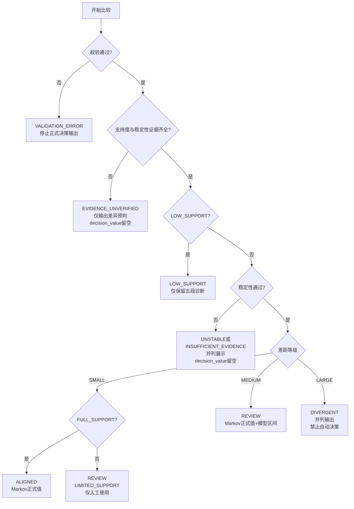

# 快消品 MTA 双模型差异量化与输出规范

## 1. 文档目的

本文规定如何比较 AMC MTA 的 Markov 与 Path-level Shapley 输出，量化什么是“小差距”“中等差距”和“大差距”，以及每种情况应如何生成业务结果。

适用范围：

- 产品类型：快消品；
- 触点粒度：`AD_PRODUCT:FORMAT:PLACEMENT:CREATIVE:INTERACTION_TYPE`；
- 主模型：Markov；
- 参照模型：Path-level Shapley；
- 主 outcome：`purchase_count_share`；
- 辅助 outcome：`revenue_share`、`converted_user_share`。

本文中的阈值是 **v1 治理线**，用于当前项目落地。积累至少 12 周真实数据后，应使用滚动窗口和重采样结果重新校准。

可靠性与决策治理是两个不同层次。可靠性只由 `calculation_valid`、
`data_support_sufficient`、`models_consistent` 三个布尔值按 AND 合成；稳定性、
差距等级、跨 outcome 表现、`decision_status` 和 `automation_allowed` 均不参与
可靠性计算。

### 1.1 一页结论

| 场景 | 正式输出 |
| --- | --- |
| 输入校验失败 | `VALIDATION_ERROR`，不生成决策值 |
| 支持度或稳定性未验证 | 仅生成差异预览，`decision_value` 为空 |
| 小差距、稳定、支持充分 | Markov 作为正式值，可自动使用 |
| 中等差距且稳定 | Markov 作为人工决策值，同时展示 Shapley 和模型区间 |
| 大差距且稳定 | 两模型并列，不平均，阻断自动决策 |
| 任意差距但结果不稳定 | 仅作诊断，阻断决策 |

上表描述决策治理，不是可靠性等级。可靠性只有 `RELIABLE` 与 `UNRELIABLE`：
计算有效、数据支撑充分、模型一致三项全真才是 `RELIABLE`。

## 2. 核心原则

### 2.1 两个模型不是同一真值的重复测量

当前 Markov 衡量顺序和转移结构中的路径依赖；当前 Shapley 将每条路径的 outcome 分配给路径中的唯一触点，衡量路径参与贡献。

因此：

- 差距小表示两种归因视角接近，不表示结果必然正确；
- 差距大表示模型假设敏感，不表示其中一个模型必然错误；
- 两者都不是因果增量模型；
- 不使用默认 `50% Markov + 50% Shapley` 作为正式结果。

### 2.2 快消品采用 Markov 主口径

快消品路径通常较短、曝光频率较高、重复购买较多。Markov 能利用顺序、重复触点和购买用户模型中的 Conversion/Null 信息，因此作为治理上的正式模型：

```text
official_model = MARKOV
benchmark_model = PATH_LEVEL_SHAPLEY
```

Shapley 用于识别模型敏感性和路径参与度，不自动与 Markov 合并。

### 2.3 三个 outcome 独立判断

不得用一个 outcome 的一致性替代其他 outcome：

1. `purchase_count_share`：快消品主判断口径；
2. `revenue_share`：检查高客单价或组合购买是否改变结论；
3. `converted_user_share`：检查购买用户覆盖，不等同于新客；

如果业务需要拉新判断，必须额外引入 new-to-brand 指标，不能把 `converted_users` 直接解释为新客。

## 3. 比较前的强制校验

任一校验失败时，状态设为 `VALIDATION_ERROR`，停止正式模型差异判断：

- 两个模型的五段触点集合完全相同；
- 每个 outcome 的两模型 share 各自合计为 1，允许误差 `1e-6`；
- attributed outcome 合计与 AMC 输入守恒；
- 所有 share 有限且非负；
- Markov 与 Shapley 使用相同账户、窗口和触点粒度；
- CSV 物理表头与字段契约完全一致，无前导或尾随空格；
- 无重复触点行。

零 outcome 是合法边界：如果两模型某 outcome 总量同时为 0，则该 outcome 记为 `NO_OUTCOME`，不要求 share 合计为 1，也不参与 TVD 和排名计算；如果只有一个模型为 0，则记为 `VALIDATION_ERROR`。

只有本节全部严格校验通过，产物中的 `calculation_valid` 才写为 `true`。任一
校验失败继续 fail-fast，不发布新的比较产物，因此不会生成
`calculation_valid=false` 的正式预览行。

## 4. 触点级量化公式

对触点 `i` 和 outcome `o`：

```text
M(i,o) = Markov share
S(i,o) = Shapley share

mean_share = (M + S) / 2
gap_pp = 100 × |M - S|
signed_gap_pp = 100 × (M - S)
relative_gap = |M - S| / mean_share
model_low = min(M, S)
model_high = max(M, S)
```

`gap_direction` 由 `signed_gap_pp` 确定：正值为 `MARKOV_HIGH`，负值为 `SHAPLEY_HIGH`，绝对值不超过数值容差 `1e-6pp` 时为 `TIE`。跨窗口的方向一致率定义为：

```text
gap_direction_rate = 众数非TIE方向出现的窗口数 / 非TIE有效窗口数
```

若所有窗口均为 `TIE`，则 `gap_direction_rate=1`；缺少有效窗口时记为空。

当 `mean_share = 0` 时，`relative_gap = 0`。

注意：

- `gap_pp` 单位是百分点；
- `model_low ~ model_high` 称为 **模型区间（model envelope）**；
- 模型区间不是统计置信区间；
- 长尾触点优先按绝对差和支持度管理，不因相对差很大自动升级为重大业务差异。

## 5. 触点级差距阈值

按以下顺序判定，先命中的规则优先。

### 5.1 长尾触点

```text
mean_share < 1%
```

状态设为 `LONG_TAIL`。如果 `relative_gap >= 30%`，增加原因码：

```text
LONG_TAIL_MODEL_SENSITIVE
```

处理方式：

- 保留明细；
- 管理层报表继续展示完整五段键；
- 不因相对差大单独触发预算动作；
- 只有绝对贡献或原始支持度达到门槛后，才升级为独立触点分析。

### 5.2 小差距

```text
gap_pp <= 1.0
且 relative_gap <= 20%
```

状态：`SMALL / ALIGNED`

含义：模型对该触点的业务量级判断接近。

### 5.3 大差距

满足任一条件：

```text
gap_pp >= 3.0
```

或：

```text
mean_share >= 3%
且 gap_pp >= 1.5
且 relative_gap >= 50%
```

状态：`LARGE / DIVERGENT`

对于头部触点，增加关键分歧标志：

```text
mean_share >= 10%
且 gap_pp >= 5.0

critical_divergence = true
```

### 5.4 中等差距

不属于长尾、小差距或大差距的触点：

```text
MEDIUM / REVIEW
```

该状态通常包括：

- 头部触点差 1–3 个百分点；
- 核心触点存在明显但未达到重大阈值的相对差；
- 两模型排名接近，但具体贡献数值不同。

### 5.5 快消品阈值设计理由

快消品具有高频曝光、重复购买和促销波动，长尾触点很容易出现“绝对差很小、相对差很大”。因此 v1 同时使用绝对百分点与相对差：

- `1pp` 以内且相对差不超过 `20%`，才视为业务量级接近；
- `3pp` 以上直接视为重大模型敏感性，防止头部贡献被不同假设大幅改写；
- `1.5pp + 50%相对差` 用于捕获份额不算最大、但被模型接近翻倍或减半的核心触点；
- 平均份额低于 `1%` 的触点先按长尾治理，避免相对差放大噪声。

这些线是运营治理阈值，不是统计显著性检验，也不替代支持度和稳定性证据。

可靠性字段 `models_consistent` 不直接复用上述分类结果。对非零 outcome，它只
检查：

```text
gap_pp <= 1.0
且 relative_gap <= 0.20
```

因此非零长尾触点只要两个数值门槛均通过，也可得到
`models_consistent=true`。门槛用解析时保留的未舍入原始十进制 share 精确计算，
不先按输出显示值舍入，也不使用容差放宽；严格大于任一门槛即为 `false`。零 outcome 固定为
`models_consistent=false`。

## 6. 整体模型差异

### 6.1 Total Variation Distance

```text
TVD = 0.5 × Σ |M(i) - S(i)|
```

TVD 表示需要重新分配多少总贡献份额，才能使两个模型完全一致。

| TVD | 分布差异等级 |
| ---: | --- |
| `<= 5%` | `SMALL` |
| `> 5%` 且 `<= 12%` | `MEDIUM` |
| `> 12%` | `LARGE` |

### 6.2 排名一致性

使用 Spearman 相关系数。并列值使用平均排名；触点少于 2 个或任一模型所有 share 完全相同时，rho 记为空、排名一致性记为 `UNDEFINED`，整体状态不得判为 `CONSISTENT`。

| Spearman rho | 排名一致性 |
| ---: | --- |
| `>= 0.90` | `HIGH` |
| `>= 0.75` 且 `< 0.90` | `MEDIUM` |
| `< 0.75` | `LOW` |

### 6.3 Top K 重合率

令 `k = min(5, touchpoint_count)`。按 share 降序排列；第五名并列时使用规范触点键字典序作为确定性 tie-break。输出 `top_k` 和 `top_k_overlap`，避免触点不足 5 个时误读。

```text
top_k_overlap_rate = top_k_overlap / k
```

| Top K 重合率 | 等级 |
| ---: | --- |
| `>= 80%` | `HIGH` |
| `>= 60%` 且 `< 80%` | `MEDIUM` |
| `< 60%` | `LOW` |

### 6.4 整体比较状态

```text
CONSISTENT
  TVD <= 5%
  且 rho >= 0.90
  且 top_k_overlap_rate >= 80%
  且 critical_divergence_count = 0

MODEL_DIVERGENT
  TVD > 12%
  或 rho < 0.75
  或 top_k_overlap_rate < 60%

MIXED_REVIEW
  其他情况
```

该字段统一命名为 `comparison_status`。它只描述两个模型的整体点估计诊断，不能
覆盖触点级状态，也不代表结果已达到决策条件或可靠性条件。例如
`comparison_status=MIXED_REVIEW` 时，仍可能存在必须单独处理的
`critical_divergence`；支持度或稳定性未通过时，最终 `decision_status` 仍须
阻断。`comparison_status`、TVD、Spearman、Top-K 和关键分歧均不参与第 8.1 节
的可靠性计算。

## 7. 五粒度唯一治理口径

所有比较、支持度、排名、整体指标和推荐状态只使用完整五段键：

```text
AD_PRODUCT:FORMAT:PLACEMENT:CREATIVE:INTERACTION_TYPE
```

`IMPRESSION` 和 `CLICK` 即使共享其他广告属性，也始终是两个独立触点。当前输出
始终保留 `INTERACTION_TYPE`，支持度、差距与原因码均在完整五段键上计算。
因此触点的 `difference_level` 和 `reason_code` 只描述该五段触点本身。

## 8. 支持度规则

模型差距必须在原始支持度之后判断。不得使用 attributed outcome 作为样本门槛，否则会形成循环判断。

建议新增以下原始支持字段：

```text
raw_unique_paths
raw_converted_users
raw_purchase_count
raw_revenue
```

计算语义：

- 先对每条 AMC 聚合路径内的触点去重；同一触点在同一路径重复出现，只计一次支持；
- `raw_unique_paths`：包含该触点的不同规范化 path 字符串数量；
- `raw_converted_users`：所有包含该触点的路径行 `converted_users` 之和；
- `raw_purchase_count`：所有包含该触点的路径行 `purchase_count` 之和；
- `raw_revenue`：所有包含该触点的路径行 `revenue` 之和；
- 这些字段用于支持度，不是归因结果；同一条路径可同时支持多个触点，因此它们跨触点不守恒。

快消品 v1 门槛：

| 支持等级 | 原始购买次数 | 原始购买用户 | 唯一路径数 |
| --- | ---: | ---: | ---: |
| `FULL_SUPPORT` | `>= 100` | `>= 50` | `>= 10` |
| `LIMITED_SUPPORT` | `>= 30` | `>= 20` | `>= 5` |
| `LOW_SUPPORT` | 任一低于 LIMITED 门槛 | 任一低于 LIMITED 门槛 | 任一低于 LIMITED 门槛 |

处理方式：

- `FULL_SUPPORT`：允许五段独立结论；
- `LIMITED_SUPPORT`：允许展示，`review_required=true`、`automation_allowed=false`；
- `LOW_SUPPORT`：保留五段诊断，但不产生决策值，也不允许自动化；
- 当前治理输出已从 AMC 聚合路径生成完整原始支持字段；样例的 17 个五段触点中，16 个为 `LOW_SUPPORT`、1 个为 `LIMITED_SUPPORT`，没有 `FULL_SUPPORT`。

只有在外部数据未提供 AMC 路径、无法重算上述字段时，才使用 `SUPPORT_UNVERIFIED`。该状态不等于通过或失败；在补齐证据前：

```text
decision_status = EVIDENCE_UNVERIFIED
decision_value = 空
automation_allowed = false
```

### 8.1 数据支撑布尔值

可靠性字段 `data_support_sufficient` 使用最低门槛：

```text
raw_purchase_count >= 30
且 raw_converted_users >= 20
且 raw_unique_paths >= 5
```

三个条件全部满足为 `true`；因此 `FULL_SUPPORT` 与 `LIMITED_SUPPORT` 都通过，
`LOW_SUPPORT` 不通过。零 outcome 固定为 `false`。

可靠性最终字段只使用三项标准：

```text
calculation_valid
AND data_support_sufficient
AND models_consistent
```

三项全真时：

```text
reliability_status = RELIABLE
reliability_reason = ALL_CRITERIA_PASSED
```

否则为 `UNRELIABLE`，失败原因只允许以下代码，并按固定顺序连接：

```text
CALCULATION_INVALID
INSUFFICIENT_DATA_SUPPORT
MODELS_INCONSISTENT
```

## 9. 稳定性规则

差距小但不稳定，不能称为共识；差距大但稳定，才是结构性分歧。

本节只约束决策与长期解释，不参与第 8.1 节的可靠性计算。

### 9.1 推荐运行方法

- 至少 12 周历史数据；
- 8 个滚动 28 天窗口，步长 7 天；
- 每个窗口使用额外 lookback buffer 构建路径，避免窗口起点截断；
- 至少 500 次合适的重采样；
- 不直接对 AMC 聚合 CSV 行做普通 bootstrap，应从底层 journey/周期重建，或对聚合计数采用参数重采样。

### 9.2 触点稳定条件

头部触点定义为滚动窗口中位 `mean_share >= 10%`。头部触点同时满足：

```text
Markov 90%区间宽度 <= max(2pp, Markov中位share × 50%)
Shapley 90%区间宽度 <= max(2pp, Shapley中位share × 50%)
Top5入选率 >= 75%
gap方向一致率 >= 80%
```

非长尾触点同时满足：

```text
Markov 90%区间宽度 <= max(1pp, Markov中位share × 75%)
Shapley 90%区间宽度 <= max(1pp, Shapley中位share × 75%)
difference_level在 >= 75% 窗口中保持同档
MEDIUM/LARGE触点的gap方向一致率 >= 75%
```

长尾触点不单独产生决策稳定性结论，只保留五段诊断。

### 9.3 整体稳定条件

```text
TVD档位在 >= 80% 重采样中保持一致
且 top_k_overlap_rate >= 80% 的重采样占比 >= 80%
```

当前项目尚未生成滚动窗口和重采样结果，因此当前数据应标记：

```text
stability_level = UNVERIFIED
```

稳定性为 `UNVERIFIED` 时，与支持度未验证采用相同处理：只输出差异预判，`decision_value` 留空。

## 10. 输出状态机

本状态机管理 `decision_status`、`decision_value` 和自动化权限，与二元
`reliability_status` 并行存在，不是可靠性合成规则。



优先级：

```text
VALIDATION_ERROR
→ EVIDENCE_UNVERIFIED
→ LOW_SUPPORT
→ UNSTABLE
→ ALIGNED / REVIEW / DIVERGENT
```

### 10.1 状态与输出字段矩阵

`official_share` 是用于展示的正式模型口径，`decision_value` 是允许进入预算或优化流程的值；两者不能混用。

| 条件/状态 | `official_model` | `official_share` | `decision_value` | `review_required` | `automation_allowed` |
| --- | --- | --- | --- | --- | --- |
| `VALIDATION_ERROR` | 空 | 空 | 空 | `true` | `false` |
| `EVIDENCE_UNVERIFIED` 且输入有效 | `MARKOV` | 可展示 Markov 值 | 空 | `true` | `false` |
| `LOW_SUPPORT` | `MARKOV` | 五段值仅诊断 | 空 | `true` | `false` |
| `LIMITED_SUPPORT` + `SMALL/MEDIUM` | `MARKOV` | Markov share | Markov share，仅供人工审批 | `true` | `false` |
| `ALIGNED` | `MARKOV` | Markov share | Markov share | `false` | `true` |
| `REVIEW` | `MARKOV` | Markov share | Markov share，仅供人工审批 | `true` | `false` |
| `DIVERGENT` | `MARKOV` | Markov share | 空 | `true` | `false` |
| `UNSTABLE` | `MARKOV` | Markov share | 空 | `true` | `false` |
| `INSUFFICIENT_EVIDENCE` | `MARKOV` | Markov share | 空 | `true` | `false` |

当物理输入仍是 `VALIDATION_ERROR` 时，不得把经过临时清洗得到的预览值写入正式 `official_share`；预览必须写入独立诊断文件或明确标记 `PREVIEW_ONLY`。

## 11. 不同差距的输出处理

### 11.1 小差距且稳定

```text
decision_status = ALIGNED
official_model = MARKOV
official_share = markov_share
decision_value = markov_share
review_required = false
automation_allowed = true
```

展示 Markov 正式值、Shapley 参照值和模型区间。不需要平均。

示例：

```text
正式订单贡献：18.0%
Shapley参照：17.3%
模型区间：17.3%–18.0%
状态：ALIGNED
```

### 11.2 中等差距且稳定

```text
decision_status = REVIEW
official_model = MARKOV
official_share = markov_share
decision_value = markov_share
review_required = true
automation_allowed = false
```

处理要求：

- 展示模型区间；
- 展示差距方向；
- 不基于 1–2 个百分点的模型差异自动调整预算。

### 11.3 大差距且稳定

```text
decision_status = DIVERGENT
official_model = MARKOV
official_share = markov_share
decision_value = 空
review_required = true
automation_allowed = false
```

不得输出共识平均值。并列展示：

- Markov 路径依赖贡献；
- Shapley 路径参与贡献；
- 模型区间；
- 五段差距方向和原因码。

如果管理报表必须显示一个正式数字，继续显示 Markov，但必须标记：

```text
MANUAL_ONLY
```

### 11.4 差距小但不稳定

```text
decision_status = UNSTABLE
official_share = markov_share
decision_value = 空
review_required = true
automation_allowed = false
```

不能因为两个点估计接近就称为高可信。

### 11.5 差距大且不稳定

```text
decision_status = INSUFFICIENT_EVIDENCE
official_share = markov_share
decision_value = 空
review_required = true
automation_allowed = false
```

仅保留诊断输出，不形成业务结论。

## 12. 效率指标处理

两模型使用相同成本，因此 ROAS、ROI、CPA 的差异来自归因分子或归因订单数，而不是成本模型本身。

必须先比较 share，再计算效率指标：

```text
Markov attributed outcome → Markov ROAS/ROI/CPA
Shapley attributed outcome → Shapley ROAS/ROI/CPA
```

禁止：

- 平均 Markov ROAS 与 Shapley ROAS；
- 平均 Markov ROI 与 Shapley ROI；
- 平均 Markov CPA 与 Shapley CPA；
- 使用零成本行的空效率指标判断模型一致性。

如果未来采用经过校准的组合贡献，必须先组合 attributed outcome，再使用唯一成本重新计算效率指标。

## 13. 建议输出文件

### 13.1 触点级比较文件

文件名：

```text
amc_mta_model_comparison_touchpoints.csv
```

字段：

```text
touchpoint
interaction_type
outcome
markov_share
shapley_share
mean_share
gap_pp
signed_gap_pp
relative_gap
model_low
model_high
raw_unique_paths
raw_converted_users
raw_purchase_count
raw_revenue
support_level
markov_interval_low
markov_interval_high
shapley_interval_low
shapley_interval_high
gap_direction
gap_direction_rate
top5_entry_rate
difference_level
stability_level
comparison_status
critical_divergence
operational_status
decision_status
official_model
official_share
decision_value
review_required
automation_allowed
reason_code
calculation_valid
data_support_sufficient
models_consistent
reliability_status
reliability_reason
```

### 13.2 整体摘要文件

文件名：

```text
amc_mta_model_comparison_summary.csv
```

字段：

```text
outcome
grain
report_start_date
report_end_date
max_touchpoint_gap_days
reference_window_days
touchpoint_count
tvd
spearman_rho
top_k
top_k_overlap
top_k_overlap_rate
critical_divergence_count
distribution_gap
rank_consistency
support_status
stability_status
operational_status
validation_error_count
validation_reason_code
comparison_status
decision_status
calculation_valid
data_support_sufficient
models_consistent
reliability_status
reliability_reason
```

### 13.3 管理层结果文件

文件名：

```text
amc_mta_recommended_attribution.csv
```

输入校验通过后，文件包含所有可解析触点，便于管理层看到被阻断的结果。`VALIDATION_ERROR` 时不生成该文件，只生成校验报告。字段至少包括：

- Markov 正式 share；
- Shapley 参照 share；
- 模型区间；
- 决策状态；
- 人工复核标志。
- 三项可靠性布尔值、二元状态和固定顺序原因。

只有支持度与稳定性通过的记录才允许产生 `decision_value`：`ALIGNED` 可直接使用，`REVIEW` 仅供人工审批后使用。`DIVERGENT`、`UNSTABLE`、`INSUFFICIENT_EVIDENCE`、`LOW_SUPPORT`、`EVIDENCE_UNVERIFIED` 记录仍保留作诊断，但 `decision_value` 必须为空。

触点比较与推荐文件中相同 `touchpoint + outcome` 的五个可靠性字段必须完全
一致。摘要按 outcome 汇总：分别对该 outcome 全部触点的
`calculation_valid`、`data_support_sufficient`、`models_consistent` 做 AND，
再调用相同的三项可靠性合成规则。摘要不得从 `support_status`、
`comparison_status`、TVD、Spearman、Top-K、关键分歧或差距等级反推可靠性；
这些字段只是并行诊断。原始 Markov 与 Shapley 文件不增加可靠性字段。

## 14. 判定伪代码

```python
def classify_touchpoint(markov_share, shapley_share):
    mean_share = (markov_share + shapley_share) / 2
    gap_pp = abs(markov_share - shapley_share) * 100
    relative_gap = 0 if mean_share == 0 else abs(markov_share - shapley_share) / mean_share

    if mean_share < 0.01:
        reason = "LONG_TAIL_MODEL_SENSITIVE" if relative_gap >= 0.30 else "LONG_TAIL"
        return "LONG_TAIL", reason

    if gap_pp <= 1.0 and relative_gap <= 0.20:
        return "SMALL", "ALIGNED"

    if gap_pp >= 3.0:
        return "LARGE", "ABSOLUTE_GAP"

    if mean_share >= 0.03 and gap_pp >= 1.5 and relative_gap >= 0.50:
        return "LARGE", "RELATIVE_AND_ABSOLUTE_GAP"

    return "MEDIUM", "MODEL_REVIEW"
```

可靠性独立合成：

```python
calculation_valid = True  # 只有全部严格校验通过才会生成产物
data_support_sufficient = (
    has_outcome
    and raw_purchase_count >= 30
    and raw_converted_users >= 20
    and raw_unique_paths >= 5
)
models_consistent = (
    has_outcome
    and gap_pp <= 1.0
    and relative_gap <= 0.20
)

passed = calculation_valid and data_support_sufficient and models_consistent
reliability_status = "RELIABLE" if passed else "UNRELIABLE"

# 按 outcome 汇总时，先逐字段 AND 触点级布尔值，再复用同一合成函数。
summary_calculation_valid = all(row.calculation_valid for row in outcome_rows)
summary_data_support_sufficient = all(
    row.data_support_sufficient for row in outcome_rows
)
summary_models_consistent = all(row.models_consistent for row in outcome_rows)
summary_reliability = reliability_fields(
    summary_calculation_valid,
    summary_data_support_sufficient,
    summary_models_consistent,
)
```

`gap_pp` 与 `relative_gap` 的门槛判断基于 share 的十进制表示，不增加 epsilon；
展示字段可以舍入，但门槛使用未舍入的十进制计算结果。

## 15. 当前输出的实际评估

数据来源：

- `modules/amc_mta/outputs/attribution/amc_markov_attribution_results.csv`
- `modules/amc_mta/outputs/attribution/amc_shapley_attribution_results.csv`

当前聚合路径与两份模型 CSV 已重新生成，物理表头和值均通过严格契约校验；
模型触点集合也与 AMC 路径集合完全一致。因此当前可以生成正式诊断文件，但
尚未完成滚动窗口和重采样稳定性验证：

```text
operational_status = VALID
validation_reason_code = 空
comparison_status = MIXED_REVIEW
decision_status = EVIDENCE_UNVERIFIED
official_share = Markov share（仅展示）
decision_value = 空
automation_allowed = false
```

以下指标来自当前正式诊断输出。支持度已从 AMC 聚合路径重算；稳定性缺失仍然
阻断任何决策值和自动预算动作。

### 15.1 整体结果

| Outcome | TVD | Spearman rho | Top 5重合 | 整体判断 |
| --- | ---: | ---: | ---: | --- |
| 购买用户 share | 9.160% | 0.9877 | 5/5 | 分布中度差异、排名高度一致 |
| 购买次数 share | 9.228% | 0.9896 | 5/5 | 分布中度差异、排名高度一致 |
| 收入 share | 9.821% | 0.9828 | 4/5 | 分布中度差异、排名高度一致 |

当前正式诊断状态：

```text
operational_status = VALID
comparison_status = MIXED_REVIEW
distribution_gap = MEDIUM
rank_consistency = HIGH
support_status = LOW_SUPPORT
touchpoint_support = 16 LOW_SUPPORT / 1 LIMITED_SUPPORT
stability_status = UNVERIFIED
decision_status = EVIDENCE_UNVERIFIED
decision_value = 空
calculation_valid = true
data_support_sufficient = false
models_consistent = false
reliability_status = UNRELIABLE
reliability_reason = INSUFFICIENT_DATA_SUPPORT|MODELS_INCONSISTENT
```

51 条触点/outcome 记录中，51 条计算有效，3 条达到最低数据支持门槛，但这 3 条
均未通过模型一致性门槛。因此当前样例为 `0 RELIABLE / 51 UNRELIABLE`，三个
outcome 摘要也全部为 `UNRELIABLE`。

因此不能描述为“两模型完全一致”，也不能描述为“整体严重冲突”。准确表述是：

> 整体需要重新分配约 9%–10% 的贡献份额，但头部排名高度一致；主要差异集中在少数触点。

### 15.2 快消品主口径：购买次数

按本文 v1 规则，17 个触点分布为：

| 等级 | 数量 |
| --- | ---: |
| `SMALL` | 11 |
| `MEDIUM` | 4 |
| `LARGE` | 1 |
| `LONG_TAIL` | 1 |

唯一关键大差距触点：

```text
SPONSORED_PRODUCTS:PRODUCT_AD:PRODUCT_PAGE:UNSPECIFIED:CLICK
```

| 指标 | Markov | Shapley | 差距 |
| --- | ---: | ---: | ---: |
| 购买用户 share | 13.1683% | 19.6148% | 6.4465pp |
| 购买次数 share | 13.2490% | 19.7570% | 6.5080pp |
| 收入 share | 14.3173% | 21.2474% | 6.9301pp |

该触点的平均订单贡献为 16.503%，订单 gap 为 6.508pp，属于头部 `critical_divergence`。该点对订单 TVD 的贡献为 `0.5 × 6.508pp = 3.254pp`，约占整体 TVD 9.228pp 的 35.3%。它是最大单点差异，但不能据此断言全部整体差异都由该触点驱动。

当前处理：

```text
difference_level = LARGE
critical_divergence = true
comparison_status = DIVERGENT
decision_status = EVIDENCE_UNVERIFIED
official_model = MARKOV
official_share = 13.2490%（仅展示）
decision_value = 空
review_required = true
automation_allowed = false
```

需要进一步检查：

1. 该五段触点是否主要出现在较长路径中；
2. 重复点击或相邻路径位置是否提升 Markov 依赖；
3. 3/7/14 天窗口下差距方向是否一致；
4. 是否由高复购消费者或特定促销周期集中驱动。

### 15.3 中等差距触点

购买次数主口径中有 4 个 `MEDIUM` 触点：

| 触点 | Markov | Shapley | Gap |
| --- | ---: | ---: | ---: |
| SP PRODUCT_AD TOP_OF_SEARCH CLICK | 15.0912% | 13.3480% | 1.7432pp |
| SB DISPLAY REST_OF_SEARCH IMPRESSION | 5.3963% | 7.0939% | 1.6976pp |
| SP PRODUCT_AD REST_OF_SEARCH CLICK | 9.4534% | 8.2849% | 1.1685pp |
| SD VIDEO PRODUCT_PAGE CLICK | 9.4534% | 8.2849% | 1.1685pp |

这些触点的点估计差异预判为 `REVIEW`。当前支持度和稳定性尚未验证，因此可以展示 Markov 正式口径和模型区间，但 `decision_value` 必须为空，不得据此自动调整预算。只有验证通过后，才进入“Markov 决策值 + 人工复核”的正式 `REVIEW` 状态。

### 15.4 长尾触点

```text
SPONSORED_BRANDS:COMPONENT:TOP_OF_SEARCH:IMAGE:IMPRESSION
```

购买次数：

```text
Markov = 0.2419%
Shapley = 0.6360%
gap = 0.3941pp
```

相对差较大，但绝对业务份额很小。其差异等级与原因码应分别记录为：

```text
difference_level = LONG_TAIL
reason_code = LONG_TAIL_MODEL_SENSITIVE
```

不得将其与头部 6.508pp 差距视为同等级问题。

## 16. 快消品窗口敏感性

当前 14 天规则是“相邻节点间隔不超过 14 天”，路径总时长没有上限。链式路径可能远超 14 天，这会：

- 增加 Shapley 的长路径稀释；
- 增加 Markov 与 Shapley 的结构差异；
- 对高频购买和品牌老客产生更强的路径吸收。

正式使用前必须比较：

```text
3天连续间隔
7天连续间隔
14天连续间隔
```

以 7 天连续间隔为 v1 参考窗口；3 天和 14 天作为敏感性场景。若以下任一发生，则将结果设为 `UNSTABLE`：

- 对任一 `critical_divergence` 触点，3/7/14 天的 gap 正负方向不一致；
- 3 天或 14 天结果与 7 天结果的 `top_k_overlap_rate < 80%`；
- 3/7/14 天 TVD 档位同时覆盖 `SMALL` 和 `LARGE`；
- 对头部触点，三个窗口中的任一模型 share 极差大于 `max(2pp, 三窗口中位 share × 50%)`；
- 三个窗口中只有一个窗口维持该触点的原差异等级。

窗口报告必须同时保存：

```text
report_start_date
report_end_date
max_touchpoint_gap_days
reference_window_days = 7
```

上述 3/7/14 天检查是路径窗口敏感性门槛，不能替代第 9 节要求的滚动窗口和重采样稳定性验证。

## 17. 实施顺序

1. 修复当前 CSV 首尾空白并通过严格数据校验；
2. 增加原始支持度字段；
3. 生成两个模型的触点级 comparison 文件；
4. 增加五段 TVD、Spearman、Top K 和触点差距分类；
5. 按本文规则输出 `comparison_status=MIXED_REVIEW`、`decision_status=EVIDENCE_UNVERIFIED` 的诊断结果；
6. 增加 3/7/14 天窗口敏感性；
7. 增加滚动窗口和重采样稳定性；
8. 证据通过后再开放 `ALIGNED` 自动输出和 `REVIEW` 人工审批输出；
9. 有足够历史后重新校准 v1 阈值。

## 18. 最终治理结论

对快消品 MTA：

- Markov 是正式归因模型；
- Shapley 是路径参与和模型敏感性参照；
- 可靠性只由计算有效、最低数据支持和模型一致三个布尔值按 AND 合成；
- 小差距且稳定时使用 Markov 正式值；
- 中等差距时使用 Markov，但附模型区间并人工复核；
- 大差距时禁止平均，`decision_value` 留空；
- 决策值与自动化权限继续服从支持度和稳定性，但它们不改变二元可靠性公式；
- 所有差异只按完整五段触点解释；
- 当前严格校验通过的样例呈现“整体中度差异、排名高度一致、一个关键触点的点估计大分歧”；可靠性为 `0 RELIABLE / 51 UNRELIABLE`。支持度已从 AMC 路径重算，但在稳定性通过前不得称为结构性分歧，独立决策状态仍为 `EVIDENCE_UNVERIFIED`。
