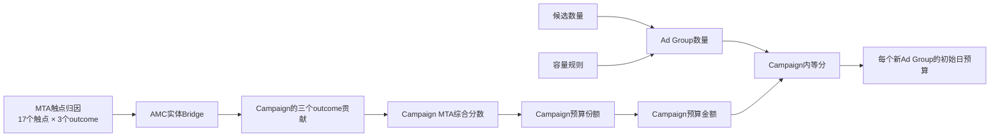

# 当前 Ad Group 初始预算的计算过程

## 1. 文档目的

本文详细解释当前 `mta_strategy_recommender` 如何从 MTA 归因结果得到每个新 Ad Group 的
初始日预算。

当前实现的准确表述是：

> 先用 MTA 归因结果计算四个 Campaign 的预算份额，再根据候选数量计算每个 Campaign 需要的
> 新 Ad Group 数量，最后把 Campaign 预算平均分配给其内部的新 Ad Group。

因此，当前模型并没有分别预测每个新 Ad Group 的表现，也没有为同一 Campaign 内的不同新组
计算不同的效果分数。输出是确定性的初始预算起点：

```text
recommendation_type = INITIAL_SEED
is_optimized = false
allocation_basis = CAMPAIGN_MTA_EQUAL_SPLIT
```

## 2. 当前计算使用的数据

下表的策略模型路径均相对于 `modules/mta_strategy_recommender` 模块根目录；MTA 源数据路径
相对于 workspace 根目录。

| 数据 | 当前文件 | 进入计算的内容 |
| --- | --- | --- |
| 策略请求 | `data/simulated/strategy_request.json` | Campaign Group 日预算、四个 Campaign、outcome 权重、容量规则、每组最低日预算 |
| 候选池 | `data/simulated/candidate_pool.json` | 各 Campaign 的合格 Keyword unit、SKU、合法 Pair、Target、Audience 数量 |
| MTA 归因 | `../amc_mta/outputs/attribution/amc_mta_recommended_attribution.csv` | 每个触点、每个 outcome 的 `recommended_value` 和可靠性状态 |
| AMC 实体聚合 | `../amc_mta/data/simulated/amc_touchpoint_entity_aggregate_sample.csv` | 触点与历史 Campaign/Ad Group 的关系，以及用于 bridge 的辅助指标 |
| 正式结果 | `outputs/initial_budget_recommendation.json` | 四个 Campaign 的分数、数量、预算，以及每个匿名新组的预算 |

当前样例的 Campaign Group 日预算是 1,000 USD，包含四个 Campaign：

| Campaign | Ad Product |
| --- | --- |
| `C_DEMO_SP` | Sponsored Products |
| `C_DEMO_SB` | Sponsored Brands |
| `C_DEMO_SD` | Sponsored Display |
| `C_DEMO_DSP` | Amazon DSP |

## 3. 总体计算链路



整个过程可以概括成一个最终公式：

```text
某新AdGroup的初始日预算
= CampaignGroup总日预算
  × CampaignMTA分数 / 所有CampaignMTA分数之和
  ÷ 该Campaign推荐AdGroup数量
```

后续章节逐层解释这个公式中的每一项来自哪里。

## 4. 第一步：读取每个 MTA 触点的归因值

MTA 文件的粒度是：

```text
touchpoint × outcome
```

当前触点是五段广告属性组合：

```text
AD_PRODUCT:FORMAT:PLACEMENT:CREATIVE:INTERACTION_TYPE
```

当前使用三个 outcome：

- `converted_users`；
- `purchase_count`；
- `revenue`。

每一行使用 MTA 输出的 `recommended_value`：

- `reliability_status=RELIABLE` 时，直接使用该单点数值；
- `reliability_status=UNRELIABLE` 时，`recommended_value` 是 `[low,high]`，当前实现使用区间中点；
- 使用区间中点时，结果会增加 `UNRELIABLE_MTA_RANGE_MIDPOINT_USED` warning。

每个 outcome 下，所有可用触点的数值化 `recommended_value` 必须在 `1e-9` 容差内满足：

```text
Σ TouchpointRecommendedValue = 1
```

这意味着 `recommended_value` 表示该 outcome 在所有 MTA 触点之间的归因份额。其中
`UNRELIABLE` 行参与求和的是 `[low,high]` 的区间中点，不是原始字符串。

当前样例共有 17 个触点和 3 个 outcome，因此读取 51 行 MTA 结果；51 行全部为
`RELIABLE`。

## 5. 第二步：通过 AMC 实体表桥接到历史 Campaign

### 5.1 为什么需要 bridge

MTA 触点只有 Ad Product、Format、Placement、Creative、Interaction Type 等广告属性，
预算输出则按 Campaign 和新 Ad Group 组织。AMC 实体聚合表用于确认一个历史触点由哪个
Campaign、哪个历史 Ad Group 承载。

### 5.2 触点内部如何分摊

对一个触点 `t` 和 outcome `o`，代码先找出同时满足以下条件的 AMC 实体行：

```text
entity.touchpoint = t
entity.campaign_id = 该Ad Product对应的Campaign
```

然后根据 outcome 选择分摊指标：

| Outcome | 第一优先的分摊指标 |
| --- | --- |
| `converted_users` | `assisted_converted_users` |
| `purchase_count` | `assisted_purchase_count` |
| `revenue` | `assisted_revenue` |

如果对应 `assisted_*` 指标的合计为零，则依次降级使用：

```text
clicks → impressions → unique_users → equal
```

某个历史实体行获得的触点信用为：

```text
EntityCredit(t,o,e)
= MTARecommendedValue(t,o)
  × EntityMetric(e) / Σ MatchingEntityMetric
```

代码会先把实体行信用汇总到历史 Ad Group，并检查一个触点的信用是否完整守恒：

```text
Σ HistoricalAdGroupCredit(t,o) = MTARecommendedValue(t,o)
```

然后再把历史 Ad Group 信用汇总到 Campaign。

### 5.3 bridge 在当前预算中的实际作用

当前一个 Ad Product 只对应一个 Campaign。因此，一个触点通过历史实体分摊后再汇总回
Campaign，其总值仍然等于原触点的 MTA 归因值。

AMC bridge 当前主要完成三件事：

1. 验证 MTA 触点与历史 Campaign/Ad Group 的数据关系；
2. 记录该 Campaign 的历史 Ad Group 数量、触点数量和分摊方法；
3. 保证触点信用在汇总过程中没有丢失或重复增加。

bridge 中的历史 Ad Group 权重不会直接传给未来新 Ad Group。输出中的新组使用新的匿名
`ad_group_slot_id`，不是历史 Ad Group 的延续。

## 6. 第三步：得到每个 Campaign 的三个 outcome 贡献

对 Campaign `c` 和 outcome `o`：

```text
CampaignOutcomeContribution(c,o)
= Σ 经过bridge后属于Campaign c的触点信用
```

当前正式结果为：

| Campaign | Converted Users | Purchase Count | Revenue |
| --- | ---: | ---: | ---: |
| SP | 0.242017 | 0.241830 | 0.234920 |
| SB | 0.298984 | 0.299673 | 0.293010 |
| SD | 0.235849 | 0.234967 | 0.231124 |
| DSP | 0.223150 | 0.223530 | 0.240946 |
| 合计 | 1.000000 | 1.000000 | 1.000000 |

例如，SP 的 `converted_users=0.242017` 表示：在当前 MTA 结果中，经过 AMC bridge 后，
24.2017% 的转化用户归因信用汇总到了 SP Campaign。

它不是 0.242017 个真实用户，也不是增加预算后的新增转化预测。

## 7. 第四步：把三个 outcome 合成为 Campaign MTA 分数

当前输入权重为：

```text
converted_users = 0.4
purchase_count  = 0.3
revenue         = 0.3
```

权重之和必须等于 1。Campaign 综合分数为：

```text
CampaignMTAScore
= 0.4 × ConvertedUsersContribution
+ 0.3 × PurchaseCountContribution
+ 0.3 × RevenueContribution
```

以 SP 为例：

```text
SP Campaign MTA Score
= 0.4 × 0.242017
+ 0.3 × 0.241830
+ 0.3 × 0.234920
= 0.0968068 + 0.0725490 + 0.0704760
= 0.2398318
```

四个 Campaign 的计算结果为：

| Campaign | 计算结果 |
| --- | ---: |
| SP | 0.2398318 |
| SB | 0.2973985 |
| SD | 0.2341669 |
| DSP | 0.2286028 |
| 合计 | 1.0000000 |

因为每个 outcome 的 Campaign 贡献之和为 1，且 outcome 权重之和也为 1，所以当前
`campaign_score_total=1.0`。

## 8. 第五步：把 Campaign 分数转换成预算份额

Campaign 预算份额为：

```text
CampaignBudgetShare
= CampaignMTAScore / Σ AllCampaignMTAScore
```

当前总分恰好等于 1，因此每个 Campaign 的预算份额在数值上等于其 MTA 综合分数：

| Campaign | Campaign 预算份额 | 占比 |
| --- | ---: | ---: |
| SP | 0.2398318 | 23.98318% |
| SB | 0.2973985 | 29.73985% |
| SD | 0.2341669 | 23.41669% |
| DSP | 0.2286028 | 22.86028% |
| 合计 | 1.0000000 | 100% |

Campaign Group 总日预算为 1,000 USD，因此：

```text
CampaignBudget = CampaignBudgetShare × 1,000
```

得到：

| Campaign | Campaign 初始日预算（展示值保留 4 位小数） |
| --- | ---: |
| SP | 239.8318 USD |
| SB | 297.3985 USD |
| SD | 234.1669 USD |
| DSP | 228.6028 USD |
| 合计 | 1,000.0000 USD |

## 9. 第六步：计算每个 Campaign 需要多少个 Ad Group

Ad Group 数量不由 MTA 分数决定，而是由候选数量和容量规则决定。

### 9.1 SP 和 SB

搜索类广告产品使用：

```text
N = max(
  min_ad_groups,
  ceil(eligible_keyword_unit_count / max_keyword_units_per_ad_group),
  ceil(eligible_sku_count / max_skus_per_ad_group),
  ceil(eligible_legal_pair_count / max_legal_pairs_per_ad_group)
)
```

当前 SP：

```text
N = max(1, ceil(3/50), ceil(3/20), ceil(3/100))
  = max(1, 1, 1, 1)
  = 1
```

当前 SB：

```text
N = max(1, ceil(4/50), ceil(4/20), ceil(4/100))
  = 1
```

### 9.2 SD 和 DSP

展示类广告产品使用：

```text
N = max(
  min_ad_groups,
  ceil(eligible_sku_count / max_skus_per_ad_group),
  ceil(eligible_target_count / max_targets_per_ad_group),
  ceil(eligible_audience_count / max_audiences_per_ad_group)
)
```

当前 SD：

```text
N = max(1, ceil(4/20), ceil(4/50), ceil(2/50))
  = 1
```

当前 DSP：

```text
N = max(1, ceil(4/20), ceil(8/50), ceil(2/50))
  = 1
```

所以当前输出是：

```text
SP / SB / SD / DSP = 1 / 1 / 1 / 1 个新Ad Group
```

这是根据聚合候选计数得到的容量下界和初始数量建议。当前没有具体候选实体和新组
assignment，因此该数量不能证明所有合法 Pair 在真实分组约束下一定能装入这些组。

如果任何容量计算结果超过 `max_ad_groups`，输入会被拒绝，而不是截断为最大值。

## 10. 第七步：Campaign 内平均分配给新 Ad Group

当前候选池只有 Keyword、SKU、Target、Audience 等数量，没有具体候选 ID，也没有候选与
未来 `ad_group_slot_id` 的对应关系。

因此，同一个 Campaign 内的多个新组在当前模型中没有可用于区分预算的特征。代码采用严格
等分：

```text
AdGroupBudgetShare = CampaignBudgetShare / RecommendedAdGroupCount

AdGroupInitialDailyBudget
= AdGroupBudgetShare × CampaignGroupTotalDailyBudget
```

等价地：

```text
AdGroupInitialDailyBudget
= CampaignBudget / RecommendedAdGroupCount
```

当前四个 Campaign 都只有一个新组，所以新组预算与所属 Campaign 预算相同：

| 新 Ad Group Slot | 所属 Campaign | 初始预算份额 | 初始日预算（展示值保留 4 位小数） |
| --- | --- | ---: | ---: |
| `C_DEMO_SP_NEW_AG_01` | SP | 0.2398318 | 239.8318 USD |
| `C_DEMO_SB_NEW_AG_01` | SB | 0.2973985 | 297.3985 USD |
| `C_DEMO_SD_NEW_AG_01` | SD | 0.2341669 | 234.1669 USD |
| `C_DEMO_DSP_NEW_AG_01` | DSP | 0.2286028 | 228.6028 USD |

### 10.1 多个新组时如何计算

假设 SP 的候选数量跨过容量边界，推荐数量变成两个，而 SP 的 MTA 分数和 Campaign Group
总预算都不变，那么：

```text
SP Campaign预算 = 239.8318 USD
每个SP新Ad Group预算 = 239.8318 / 2 = 119.9159 USD
```

两个新组获得相同预算。模型不会因为匿名编号是 `NEW_AG_01` 或 `NEW_AG_02` 而制造预算差异。

## 11. 最低预算如何影响结果

当前每个 Ad Product 的 `minimum_daily_budget_per_ad_group` 都是 25 USD。

Campaign 的最低可执行预算为：

```text
MinimumRequiredCampaignBudget
= RecommendedAdGroupCount × MinimumDailyBudgetPerAdGroup
```

当前每个 Campaign 只有一个组，所以每个 Campaign 的最低可执行日预算是 25 USD。四个
Campaign 的实际分配都高于 25 USD，因此状态均为：

```text
execution_status = EXECUTABLE
```

最低预算当前只用于检查执行状态。若某 Campaign 分配金额不足，模型会：

- 保留容量规则计算出的 Ad Group 数量；
- 保留原始预算分配；
- 标记 `INSUFFICIENT_BUDGET_FOR_MINIMUMS`；
- 不会自动减少 Ad Group 数量，也不会从其他 Campaign 调拨预算。

## 12. 没有总预算时的结果

如果输入没有 `campaign_group.total_daily_budget`，模型仍然可以计算：

- Campaign 的相对预算份额；
- 每个 Campaign 的推荐 Ad Group 数量；
- 每个新 Ad Group 的相对预算份额。

但不会输出：

- `budget_seed_total`；
- `campaign_budget_seed`；
- `initial_daily_budget`；
- `minimum_required_daily_budget`。

同时会增加：

```text
NO_BUDGET_BASELINE_RELATIVE_SHARES_ONLY
```

## 13. 预算守恒关系

当前生成器和验证器检查以下关系：

```text
Σ 每个outcome的触点MTA归因份额 = 1
Σ Campaign预算份额 = 1
Σ Campaign内Ad Group预算份额 = Campaign预算份额
Σ 全部Ad Group预算份额 = 1
Σ Campaign预算金额 = Campaign Group总预算
Σ Campaign内Ad Group预算金额 = Campaign预算金额
```

当前输出中四个新组的预算金额合计为：

```text
239.8318 + 297.3985 + 234.1669 + 228.6028
= 1,000.0000 USD
```

JSON 保存 Python 浮点数的原始值，因此个别字段可能显示为
`234.16689999999994`。这是浮点表示现象；当前版本不执行币种最小单位舍入和余数重分配。

## 14. 如何阅读一个 Ad Group 输出

以 SP 新组为例：

```json
{
  "ad_group_slot_id": "C_DEMO_SP_NEW_AG_01",
  "allocation_basis": "CAMPAIGN_MTA_EQUAL_SPLIT",
  "budget_seed_share": 0.23983179999999998,
  "initial_daily_budget": 239.8318
}
```

各字段含义：

| 字段 | 含义 |
| --- | --- |
| `ad_group_slot_id` | 下一次投放使用的匿名新组槽位，不是历史 Ad Group ID |
| `allocation_basis` | 先按 MTA 计算 Campaign 预算，再在 Campaign 内等分 |
| `budget_seed_share` | 该新组占 Campaign Group 总预算的比例 |
| `initial_daily_budget` | 该新组的初始日预算金额 |

## 15. 当前计算没有做什么

为避免误读，需要明确当前预算的边界：

- 没有预测每个新 Ad Group 的转化、购买或收入；
- 没有使用具体 Keyword 或 SKU 为新组分别评分；
- 没有把历史 Ad Group 直接当成未来新 Ad Group；
- 没有估计增加一美元预算的边际收益；
- 没有寻找最高 ROI 或数学最优预算；
- 没有输出具体 Keyword、SKU、Match Type、Target 或 Audience 投放方案。

所以，当前每个 Ad Group 预算的真正来源是：

```text
MTA决定Campaign之间的相对预算
+ 候选数量决定每个Campaign的新组数量
+ 同一Campaign内部平均分配
```

这也是输出字段 `CAMPAIGN_MTA_EQUAL_SPLIT` 的完整含义。

## 16. 对应代码和结果位置

- 核心计算：`src/budget_recommender.py`
- 生成入口：`scripts/generate_initial_budget.py`
- 策略输入：`data/simulated/strategy_request.json`
- 候选计数：`data/simulated/candidate_pool.json`
- 正式输出：`outputs/initial_budget_recommendation.json`
- 自动校验：`src/hierarchy_validator.py`
